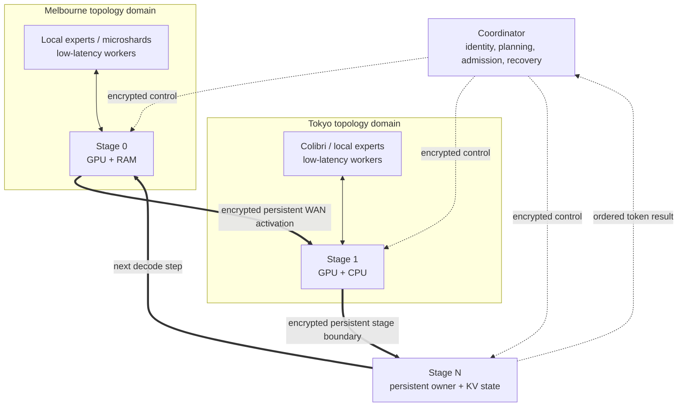

# Swarm Inference Lab

Swarm Inference Lab is an experimental runtime for distributing LLM inference across
heterogeneous machines connected over real networks, including WAN links. It explores how
NVIDIA GPUs, Apple Silicon, CPUs, and other consumer hardware can cooperate to run models that
would otherwise require larger centralized machines.

Its product objective is general-purpose global WAN distributed inference across heterogeneous
hardware, model families, operating systems, and execution engines.

The core thesis is simple: slow links need coarse, persistent execution boundaries. Across a
WAN, Swarm moves activations between contiguous model stages instead of turning every layer or
expert into an RPC. Inside a measured low-latency domain, the planner may use finer mechanisms
such as whole experts or microshards when they have positive utility.

> [!NOTE]
> Swarm Inference Lab is active experimental systems software, not a production service.
> The canonical runtime implements heterogeneous worker discovery, multiple inference engines,
> topology-aware planning, authenticated encrypted WAN transport, and persistent stage
> execution. Physical multi-machine performance validation remains ongoing.

## What exists today

- One product workflow: `swarm cluster create`, `swarm node join`, and `swarm run`.
- A model resolver for immutable Hugging Face revisions and local checkpoints, including GGUF
  variant discovery and worker-managed artifacts.
- Extensible architecture and adapter registries with native OLMoE, Qwen3 dense, and supported
  Qwen3 MoE representations.
- Three canonical engines: native stage, Colibri, and llama.cpp RPC.
- CPU, CUDA, and MPS capability detection with explicit RAM/VRAM admission.
- Measured topology domains based on RTT, bandwidth, jitter, and connection stability.
- Direct persistent stage-to-stage data flow; the coordinator does not relay hidden states.
- TLS 1.3 transport bound to durable cluster identities, plus signed control messages and
  fail-closed peer validation.
- Exact byte and connection telemetry around Swarm-managed llama.cpp RPC links.
- Explainable automatic selection and strict `--engine` / `--require-distributed` semantics.

Adding a node does not guarantee lower latency. In `speed` mode a weak node may remain idle;
`capacity` mode can include it when its memory is necessary.

## Install

A participating node installs a release; it does not need a repository clone.

- **Windows 11 x86-64:** install `SwarmInferenceSetup-x64.exe` from the project’s
  [GitHub Releases](https://github.com/mmprotest/swarm-inference-lab/releases). The per-user
  installer contains the application, locked dependency profile, and pinned engine artifacts.
- **Linux and macOS:** install the released wheel/package with the release `install.sh`. The
  script provisions a managed Python environment and selects CPU, CUDA, or MPS after an
  operational probe.

After installation:

```bash
swarm --version
swarm node doctor
```

Windows, Linux x86-64/ARM64, and macOS ARM64 runtime adapters exist. Backend detection is not a
physical performance claim; the acceptance report keeps software and hardware evidence
separate.

### Developer, CI and offline recovery installation

Offline/recovery workflows can pass a downloaded wheel to `install.ps1 -SourceWheel ...` or
`install.sh --source-wheel ...`. These repository scripts are for development, CI, and recovery;
normal Windows nodes use the signed release installer above.

## Cluster quick start

On the coordinator:

```bash
swarm cluster create --name my-swarm
```

The command prints a short-lived, single-use pairing URI. On another independently installed
node:

```bash
swarm node join "<pairing-uri>"
```

Inspect readiness, then use the general model interface:

```bash
swarm cluster status

swarm run <hugging-face-model-or-local-model> \
  --mode speed \
  --prompt "Explain distributed inference."
```

Inspect a genuinely distributed plan before acquisition or deployment:

```bash
swarm run <model> \
  --require-distributed \
  --dry-run \
  --explain-plan \
  --prompt "Hello"
```

Explicit engine requests fail if that engine does not pass model/runtime/hardware preflight:

```bash
swarm run <model> --engine native-stage --prompt "Hello"
swarm run <model> --engine colibri --prompt "Hello"
swarm run <model> --engine llamacpp-rpc --prompt "Hello"
```

Only automatic selection (omit `--engine`) may choose among compatible engines. Likewise,
`--require-distributed` fails unless required computation is placed on at least two physical
hosts; it never silently runs the complete model on the coordinator.

## Product architecture



The coordinator owns membership, capability collection, engine competition, deployment,
session admission, and ordered result publication. Persistent workers own their model stages
and KV state. Once admitted, activations travel directly through the stage ring; the coordinator
is outside the steady-state activation path.

The adapter registry is separate from engine selection:

```text
Model resolver -> architecture detection -> native adapter registry
                                           | OLMoE
                                           | Qwen3 dense
                                           | Qwen3 MoE (supported representations)
                                           ` future adapters

Resolved model + worker capabilities + topology -> execution engine registry
                                                   | native-stage
                                                   | colibri
                                                   ` llamacpp-rpc
```

OLMoE is one adapter, not the identity of the product. Product code does not import experiment
implementations; experiments remain evidence and research workloads.

## Execution engines

### Native stage runtime

The native engine partitions supported safetensors checkpoints into persistent contiguous
stages. It builds stage-owned artifacts, keeps KV caches isolated per request and stage, and uses
direct stage-to-stage connections. This is the Experiment 011-derived WAN-efficient path.

The installed adapter registry currently contains:

- `olmoe`
- `qwen3_dense`
- `qwen3_moe` for the Transformers `qwen3_moe` safetensors representation

Dense Qwen3 retains its optimized CUDA execution path. Sparse Qwen3 layers keep their router and
all experts with the layer-owning stage. The current native adapter does **not** claim the newer
Qwen3.5/Qwen3.6 hybrid `qwen3_5_moe` representation; that representation fails native preflight
with an actionable error rather than being forced through an incompatible Python path.

### Colibri

Colibri is the canonical optimized engine promoted from the Experiment 009 work. It is
registered alongside the other engines, reachable from normal `swarm run`, and selected only
when a pinned Colibri runtime advertises an exact model adapter, format, device, and memory fit.
The currently verified Colibri model-family profile is OLMoE. Routing-aware placement remains
evidence-gated; Experiment 009 modules are not runtime dependencies.

### llama.cpp RPC

llama.cpp RPC is the broad GGUF compatibility/capacity engine. Workers advertise a hash-bound,
pinned llama.cpp build. Before deployment, Swarm checks the resolved GGUF architecture against
loader identifiers actually present in or advertised by that build. This is an engine
capability probe, not a filename or Hugging Face repository allowlist.

llama.cpp RPC may perform finer tensor RPC than the native stage path, so the planner includes
its network behavior explicitly. WAN tensor-RPC plans are penalized and admitted for capacity or
an explicit distributed requirement when appropriate; they are not presented as equivalent to
the coarse native stage ring. Swarm’s transparent TLS metering links record exact bytes,
connections, transfers, duration, and bytes per generated token without modifying the llama.cpp
protocol. Private-protocol message counts remain `unknown` unless observable.

## Model support matrix

This table reflects the registered adapters and current verified engine manifests, not an
aspirational model list.

| Model family / format | Native stage | Colibri | llama.cpp RPC |
| --- | --- | --- | --- |
| OLMoE safetensors | Yes | Yes, with the verified `olmoe` manifest | No for safetensors; GGUF only if the pinned build advertises `olmoe` |
| Qwen3 dense safetensors | Yes | No current verified adapter | No for safetensors; compatible GGUF is runtime-probed |
| Qwen3 MoE (`qwen3_moe`) safetensors | Yes | No current verified adapter | No for safetensors; compatible GGUF is runtime-probed |
| Qwen3.5/Qwen3.6 MoE GGUF (`qwen35moe`) | No native GGUF path | No | Yes only when the pinned build proves `qwen35moe` support |
| Other GGUF | No native adapter | No | Only when exact architecture/feature support is advertised by the pinned runtime |

Unknown architecture, missing GGUF metadata, unsupported features, incompatible representation,
or insufficient memory all fail during preflight. File extension and executable presence alone
never establish compatibility.

## Qwen3.6 GGUF example

The motivating repository is
[`unsloth/Qwen3.6-35B-A3B-GGUF`](https://huggingface.co/unsloth/Qwen3.6-35B-A3B-GGUF).
Its `UD-Q4_K_M` variant is approximately 22 GB, so choose a quantization that actually fits the
participating workers.

First inspect the exact plan. GGUF uses `llamacpp-rpc`, not the native Python stage adapter:

```bash
swarm run unsloth/Qwen3.6-35B-A3B-GGUF \
  --quant UD-Q4_K_M \
  --engine llamacpp-rpc \
  --mode capacity \
  --require-distributed \
  --dry-run \
  --explain-plan \
  --prompt "Hello"
```

Preflight reports the immutable revision, selected GGUF files, `qwen3_moe` product family and
raw `qwen35moe` loader identity where available, the pinned llama.cpp runtime evidence, every
participating/excluded worker, tensor ownership, topology, and measured versus unknown network
costs. If the installed llama.cpp build does not support `qwen35moe`, the command stops here.

Run after reviewing the plan:

```bash
swarm run unsloth/Qwen3.6-35B-A3B-GGUF \
  --quant UD-Q4_K_M \
  --engine llamacpp-rpc \
  --mode capacity \
  --require-distributed \
  --prompt "Explain why WAN inference needs coarse boundaries."
```

The real 35B download and hardware execution are intentionally opt-in; ordinary CI uses small
metadata and model fixtures.

## WAN behavior

Swarm classifies directed worker relationships from measured RTT, bandwidth, jitter, and
stability, rather than geography.

- Low-latency domains may consider more boundaries, expert parallelism, and microshards.
- WAN domains favor contiguous stages, persistent connections, and few serial crossings.
- `speed` compares a distributed route with the best feasible local route and can exclude a
  slow node.
- `capacity` can accept a slower node when collective memory is required.
- Communication estimates include bytes/token, operations/token, WAN boundaries, persistent
  connection use, and confidence/provenance. `unknown` is never encoded as zero.

Experiment 010 established useful whole-expert and microshard mechanisms, but also showed why
fine-grained synchronous RPC cannot be spread blindly over slow links. Experiment 011 moved the
WAN abstraction to persistent contiguous stages and removed the coordinator from hidden-state
forwarding. The canonical runtime preserves that transition.

Swarm does not currently provide automatic NAT traversal or a relay service. Operators must
provide routable endpoints (directly or through their chosen network overlay) and configure
firewalls for the selected ports.

## Security and trust model

Pairing uses a short-lived, single-use invitation only for onboarding. Each worker node creates
and retains its own durable Ed25519 identity and independently rotatable TLS private key;
private keys are never sent to another node. The coordinator issues cluster-scoped certificates
whose TLS public keys are cryptographically bound to trusted node identity fingerprints.

WAN control and data channels use TLS 1.3. Stage-ring, expert, network-probe, worker-control,
peer, token/result, and Swarm-managed llama.cpp RPC connections validate the cluster CA and
expected durable peer identity. Long-lived coordinator requests also carry signed
identity-bound authentication.
Unknown, revoked, expired, wrongly certified, tampered, or plaintext remote peers are rejected
before inference traffic is accepted. Loopback plaintext is available only as an explicit
development/test transport. Certificates are replaceable without recreating the cluster;
rotation policy is separate from the one-time pairing credential.

To rotate a worker transport key without changing its durable cluster identity, create a fresh
single-use pairing URI on the coordinator and rejoin with
`swarm node join "<pairing-uri>" --rotate-transport-key`. The new key remains on that worker;
only its public key and replacement certificate cross the network.

This protects traffic in transit and blocks trivial network MITM attacks. It does **not** solve:

- malicious participating workers returning incorrect computation;
- Byzantine consensus or malicious-compute verification;
- privacy from a trusted node that legitimately owns a model stage and sees its inputs;
- anonymity or permissionless public compute.

Use only nodes whose operators and software you trust for the model data assigned to them.

## Planning and operation

Planning modes are:

| Mode | Objective |
| --- | --- |
| `speed` | Lowest predicted interactive latency; excludes negative-utility nodes |
| `throughput` | Highest predicted aggregate service rate for concurrent requests |
| `capacity` | Feasible collective memory, accepting latency tradeoffs explicitly |
| `balanced` | Weighted speed, headroom, reliability, and useful participation |

`swarm run --dry-run --explain-plan` reports model identity/size, architecture source, every
engine compatibility result, selection reason, worker inclusion/exclusion, stage and model-byte
ownership, device/memory estimates, topology, WAN boundaries, communication estimates with
provenance, and whether a required distributed plan was actually achieved.

Useful commands:

```text
swarm cluster status
swarm node status
swarm node doctor
swarm run ... --dry-run --explain-plan
swarm update
```

Use `--json` for one final machine document and `--ndjson` for progress/token streams. Pairing
secrets and prompts are excluded from status and normal machine output.

## Pre-physical acceptance

From a development checkout, run the software-only gate immediately before using real hosts:

```powershell
uv run python scripts/run_pre_physical_acceptance.py
```

It validates model/engine preflight, Qwen3 MoE staging, registry preservation, architecture
boundaries, no silent fallback, WAN-aware planning, network telemetry, secure control/data
paths, README commands, and wheel installation. It reports real hardware and network gates as
`NOT_RUN`; it never promotes loopback or fixture results to physical evidence.

Normal repository validation also includes:

```powershell
uv run ruff format src tests
uv run ruff check src tests
uv run mypy
uv run pytest tests/unit
uv run pytest tests/integration
uv run pytest tests/failure
```

## Current limitations

- This is experimental software; physical heterogeneous and WAN performance validation is still
  operator work.
- The coordinator is a control-plane/token-commit dependency and is not highly available.
- Recovery is verified restart-and-replay for greedy decoding; live KV migration is not
  implemented.
- Fine-grained expert/microshard execution is restricted to suitable topology domains and exact
  model/quantization identity.
- Native Qwen3 MoE currently supports the Transformers `qwen3_moe` representation, not the newer
  Qwen3.5/Qwen3.6 hybrid architecture.
- llama.cpp compatibility is limited to loader/features proven by the installed pinned build.
- No claim is made that adding nodes improves latency, or that Swarm outperforms centralized
  inference for every model/topology.

Further detail: [architecture](docs/architecture.md), [security boundary](docs/security-boundary.md),
[model artifacts](docs/model-artifacts.md), [recovery](docs/recovery.md),
[platform support](docs/platform-support.md), and
[physical two-machine acceptance](docs/physical-two-machine-acceptance.md).
