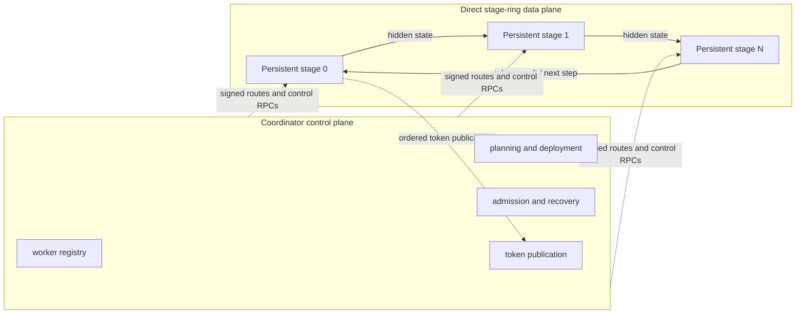

# Swarm Inference Lab

Swarm Inference Lab is an open-source prototype for measured, heterogeneous distributed
inference. Its product runtime coordinates persistent workers and sends hidden states directly
around a stage ring. The broader research question—whether independent machines can deliver
useful scaling over physical LAN or WAN links—remains open.

This is model-agnostic infrastructure, not a Kimi K3 implementation. Qwen, OLMoE, and
Kimi-shaped workloads are test vehicles for different mechanisms.

## Current status — August 2026

The software product path works in process-isolated loopback tests. The first proven product
model family is OLMoE. Physical multi-machine product performance has not been proven, and this
repository does not claim a secure public-Internet service.

Working today:

- persistent coordinator-managed OLMoE stage workers;
- direct stage-to-stage tensor transport with bounded queues and streaming token publication;
- Ed25519 worker identities, reloadable coordinator trust, signed route leases, and authenticated
  peer handshakes;
- restart-and-replay recovery with accepted-prefix verification and duplicate-token suppression;
- canonical whole-expert and native microshard backends as optional stage-internal execution
  paths; and
- simulator and historical experiment tooling kept outside the canonical product runtime.

Not yet demonstrated:

- a product acceptance run on two distinct physical machines;
- positive product scaling over a physical LAN or WAN;
- payload confidentiality on the stage-ring data plane;
- continuous tensor batching (current concurrency is session interleaving); or
- seamless failover or KV migration (current recovery restarts a session and replays it).

## Product architecture

The coordinator owns the control plane. It registers workers, plans and deploys a topology,
admits sessions, coordinates recovery, and receives token publications. It is absent from
steady-state hidden-state forwarding.



Workers and loaded model stages persist across requests. Whole-expert and microshard execution
are stage-internal optional backends; they do not create another coordinator or inference
runtime. Multiple sessions may be interleaved through bounded queues, but that is not
continuous tensor batching.

If a process, active data connection, control RPC, or publication dependency fails, the
coordinator retires the affected route generation, selects compatible replacements, installs a
higher signed generation, and replays the prompt plus the accepted greedy-token prefix. Replay
tokens are verified and suppressed. This is restart-and-replay, not seamless failover.

See [Architecture](docs/architecture.md), [security boundaries](docs/security-boundary.md), and
[recovery](docs/recovery.md) for the precise contracts.

## Secure product quick start

Python 3.11 is required. Install the appropriate backend first:

```powershell
uv sync --extra cpu
```

The shipped product configuration remains secure: `require_trusted_workers: true`. Provision
identities and trust before starting workers. These commands never print private-key bytes.

### 1. Create identities and trust workers

```powershell
uv run swarm identity create --path .swarm/coordinator/coordinator-identity.json --kind coordinator
uv run swarm identity create --path .swarm/identities/worker-1.json --kind worker
uv run swarm identity create --path .swarm/identities/worker-2.json --kind worker

$CoordinatorFingerprint = (uv run swarm identity fingerprint `
  --path .swarm/coordinator/coordinator-identity.json).Trim()

uv run swarm identity trust --coordinator-state .swarm/coordinator `
  --identity .swarm/identities/worker-1.json --label worker-1
uv run swarm identity trust --coordinator-state .swarm/coordinator `
  --identity .swarm/identities/worker-2.json --label worker-2
uv run swarm identity list-trusted --coordinator-state .swarm/coordinator
```

Set an exact local OLMoE snapshot and immutable revisions. Each worker needs access to its own
local cache or snapshot; a remote worker does not read the coordinator's filesystem.

```powershell
$ModelSnapshot = "C:\models\OLMoE-1B-7B-0125-Instruct-b89a7c4"
$ModelId = "allenai/OLMoE-1B-7B-0125-Instruct"
$ModelRevision = "b89a7c4bc24fb9e55ce2543c9458ce0ca5c4650e"
$TokenizerRevision = "sha256:d1e645ebd850d79567e531a3c103ac575d8e9cf45fa941420afc584b293438ea"
```

### 2. Start the coordinator and two persistent workers

Coordinator terminal:

```powershell
uv run swarm coordinator --config configs/product/olmoe-stage-ring.yaml `
  --state .swarm/coordinator --listen 0.0.0.0:50051 `
  --advertise 127.0.0.1:50051
```

Worker 1 terminal:

```powershell
uv run swarm worker --coordinator 127.0.0.1:50051 --worker-id worker-1 `
  --identity .swarm/identities/worker-1.json --backend torch-cpu `
  --memory-limit-gb 16 --listen 0.0.0.0:50052 --advertise 127.0.0.1:50052 `
  --stage-runtime --data-listen 0.0.0.0:50053 --data-advertise 127.0.0.1:50053 `
  --device cpu --dtype float32 --model-snapshot $ModelSnapshot `
  --trusted-coordinator-fingerprint $CoordinatorFingerprint
```

Worker 2 terminal:

```powershell
uv run swarm worker --coordinator 127.0.0.1:50051 --worker-id worker-2 `
  --identity .swarm/identities/worker-2.json --backend torch-cpu `
  --memory-limit-gb 16 --listen 0.0.0.0:50062 --advertise 127.0.0.1:50062 `
  --stage-runtime --data-listen 0.0.0.0:50063 --data-advertise 127.0.0.1:50063 `
  --device cpu --dtype float32 --model-snapshot $ModelSnapshot `
  --trusted-coordinator-fingerprint $CoordinatorFingerprint
```

Loopback proves software behavior only. Use routable host addresses and the
[physical two-machine runbook](docs/physical-two-machine-acceptance.md) for physical evidence.

### 3. Inspect, plan, and deploy

```powershell
uv run swarm workers --coordinator 127.0.0.1:50051 --json
uv run swarm model inspect --coordinator 127.0.0.1:50051 `
  --model-id $ModelId --revision $ModelRevision `
  --tokenizer-revision $TokenizerRevision --dtype float32
uv run swarm model plan --coordinator 127.0.0.1:50051 `
  --model-id $ModelId --revision $ModelRevision `
  --tokenizer-revision $TokenizerRevision --dtype float32 `
  --stage-count 2 --partition balanced --require-distributed `
  --output .swarm/plans/olmoe-two-stage.json
uv run swarm model deploy --coordinator 127.0.0.1:50051 `
  --plan .swarm/plans/olmoe-two-stage.json
uv run swarm topology --coordinator 127.0.0.1:50051 --json
```

### 4. Stream, inspect, cancel, unload, and stop

```powershell
uv run swarm submit --coordinator 127.0.0.1:50051 `
  --model-id $ModelId --model-revision $ModelRevision `
  --prompt "Write a Python function that merges two sorted lists." `
  --max-new-tokens 32 --temperature 0 --stream --ndjson

uv run swarm status --coordinator 127.0.0.1:50051 --json
uv run swarm sessions --coordinator 127.0.0.1:50051 --json
uv run swarm cancel --coordinator 127.0.0.1:50051 --request-id <request-id> --json
uv run swarm model unload --coordinator 127.0.0.1:50051 --topology-id <topology-id>
```

For cancellation, copy `request_id` from the initial NDJSON stream event while a sufficiently
long request is active. After unload completes, press Ctrl+C in each worker terminal and then in
the coordinator terminal. Both entry points close sessions, transports, and servers in `finally`
cleanup.

Concise POSIX equivalent (after `uv sync --extra cpu`):

```bash
uv run swarm identity create --path .swarm/coordinator/coordinator-identity.json --kind coordinator
uv run swarm identity create --path .swarm/identities/worker-1.json --kind worker
uv run swarm identity create --path .swarm/identities/worker-2.json --kind worker
COORDINATOR_FINGERPRINT="$(uv run swarm identity fingerprint --path .swarm/coordinator/coordinator-identity.json)"
uv run swarm identity trust --coordinator-state .swarm/coordinator --identity .swarm/identities/worker-1.json --label worker-1
uv run swarm identity trust --coordinator-state .swarm/coordinator --identity .swarm/identities/worker-2.json --label worker-2
uv run swarm coordinator --config configs/product/olmoe-stage-ring.yaml --state .swarm/coordinator --listen 0.0.0.0:50051 --advertise 127.0.0.1:50051
# In two other terminals, run the worker commands above with POSIX paths and distinct ports.
```

## Experiment history

Experiment 011 is the latest completed experiment. Its August 2026 single-workstation,
shaped-loopback evidence closed the communication-avoiding exact-decode experiment gates and
demonstrated direct contiguous-stage execution. Its network-profile results are descriptive:
they do not substitute for physical NIC, switch, independent-clock, host-failure, or
cross-machine scheduling evidence.

Experiment 010 remains the preceding expert-runtime experiment. Its retained historical runtime
is explicitly frozen and mapped in
[Experiment 010 runtime mapping](docs/experiment-010-runtime-mapping.md); canonical product code
does not import experiments. Archived Experiment 010 and 011 evidence is not rewritten by the
product runtime.

Do not begin Experiment 012 based on software-only acceptance. At least real-model product
acceptance is required; physical acceptance is preferable when a second machine is available.

## Acceptance and evidence

Run the software productization acceptance bundle with:

```powershell
uv run python scripts/run_productization_acceptance.py run `
  --output artifacts/acceptance
```

The process repeatability target uses a hard timeout per invocation and records all three full
suite runs plus all five stage-ring-module runs:

```powershell
uv run python scripts/run_productization_process_suite.py `
  --full-runs 3 --stage-runs 5 --timeout-seconds 600 `
  --output artifacts/acceptance
```

Real-model gates use the pinned checkpoint, never a synthetic fixture. Before the first
whole-expert or native-microshard run, prepare the canonical ownership artifacts. Native
microshards are physically sliced; the two banks require approximately 26 GB in addition to the
checkpoint.

```powershell
$ModelSnapshot = "artifacts/models/colibri/source-b89a7c4bc24f"
$TokenizerRevision = "sha256:d1e645ebd850d79567e531a3c103ac575d8e9cf45fa941420afc584b293438ea"
uv run python scripts/prepare_real_olmoe_expert_acceptance.py `
  --model-path $ModelSnapshot --tokenizer-revision $TokenizerRevision `
  --output artifacts/acceptance/olmoe-expert-prerequisites `
  --whole --microshards
```

Then explicitly enable and request all four real-model gates:

```powershell
$env:SWARM_RUN_PRODUCT_OLMOE_CUDA = "1"
uv run python scripts/run_productization_acceptance.py run `
  --real-model --output artifacts/acceptance
```

The runner records `PASS`, `FAIL`, `SKIP`, and `NOT_RUN` per gate. A skipped GPU or physical gate
cannot become a real-model or physical pass. JUnit execution counts distinguish a test that ran
from one that merely collected and skipped. The versioned bundle includes commands, logs,
environment and dirty-tree provenance, per-gate topology/token/recovery evidence, and SHA-256
checksums. See the physical runbook for the distinct-machine procedure.

## Security boundary

Do not expose the runtime to the public Internet or send sensitive prompts to untrusted workers.
Ed25519 identities authenticate registrations, route authority, and direct peers, but stage-ring
TCP payloads are not encrypted. Checksums detect accidental corruption; they do not provide
confidentiality or replace authentication. The current supported boundary is a trusted LAN or
private network. See [Security boundary](docs/security-boundary.md).

## Documentation

- [Architecture](docs/architecture.md)
- [Product runtime operations](docs/product-runtime.md)
- [Stage-ring protocol](docs/stage-ring-protocol.md)
- [Security boundary](docs/security-boundary.md)
- [Recovery](docs/recovery.md)
- [Physical two-machine acceptance](docs/physical-two-machine-acceptance.md)
- [Known limitations](docs/limitations.md)

Source is under [`src/swarm_inference`](src/swarm_inference), product configuration is under
[`configs/product`](configs/product), and generated acceptance evidence belongs under
`artifacts/acceptance`.

## License

Apache License 2.0. See [LICENSE](LICENSE).
