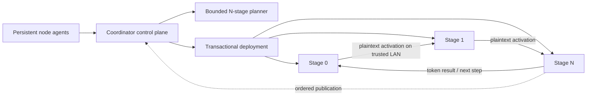

# Swarm Inference Lab

Swarm Inference Lab is a self-configuring, cross-platform cluster runtime for measured
heterogeneous inference. The first product model family is OLMoE. A coordinator manages
persistent workers and deployment transactions, while hidden states travel directly over an
ordered stage ring instead of being relayed through the coordinator.

The supported security boundary is a trusted LAN or private network. Pairing authenticates
onboarding and pins identities, but inference data-plane payloads are not encrypted. Do not
expose the runtime to the public Internet or send sensitive prompts through untrusted nodes.

## Current status — August 2026

Implemented product behavior includes:

- durable single-use X25519/HKDF/AES-GCM pairing backed by Ed25519 node identities;
- a persistent user-scoped node agent using the canonical coordinator and worker runtimes;
- operational CPU, CUDA, and MPS probing with automatic backend, dtype, memory, endpoint, and
  port selection;
- authenticated directed network measurements with freshness evidence;
- deterministic bounded N-stage planning without factorial worker permutations;
- speed, capacity, and balanced objectives where joined nodes may remain idle;
- stage-owned, content-addressed OLMoE artifacts with bounded resumable transfers;
- transactional deployment, direct stage-ring execution, streaming publication, and
  restart-and-replay recovery; and
- strict versioned state, JSON/NDJSON automation, native Windows installation, wheel recovery,
  and cross-platform CI.

Implementation support is separate from validation evidence. A clean machine reports software
and physical validation as `not-run`; OS/architecture detection, hardware visibility, imports,
and tensor probes never manufacture validation. Physical multi-machine product performance has
not been proven in this repository state. Loopback, simulation, and CI evidence do not count as
physical validation.

## Windows installation

A Windows user does not need the repository, Git, Python, `uv`, a wheel, or an administrator
terminal.

1. Open [GitHub Releases](https://github.com/mmprotest/swarm-inference-lab/releases).
2. Download `SwarmInferenceSetup-x64.exe` from the selected release.
3. Double-click it and complete the normal per-user installer.
4. Open a new terminal.
5. Run:

```powershell
swarm --version
swarm node doctor
```

Setup selects CUDA only after the installed runtime passes a real CUDA tensor doctor; automatic
selection falls back transactionally to the locked CPU profile. Installation does not create a
cluster-specific service. See [Windows installation](docs/windows-installation.md) and
[platform support](docs/platform-support.md).

## Cluster quick start

Use routable private addresses. The commands select identities, ports, backend, dtype, memory,
and storage automatically.

1. Independently install the same `SwarmInferenceSetup-x64.exe` release on both machines.
2. Create the cluster on the PC:

```powershell
swarm cluster create --name villani-home
```

3. The PC prints one complete single-use join command. Paste that command on the laptop; no
   installer or invitation file is transferred between machines.
4. Join on the laptop:

```powershell
swarm node join "swarm://<private-address>:<port>/join/<single-use-data>"
```

5. Back on the PC, inspect cluster status:

```powershell
swarm cluster status
```

6. Run the physical acceptance command from the runbook. A normal inference command is:

```powershell

swarm run allenai/OLMoE-1B-7B-0125-Instruct `
  --revision b89a7c4bc24fb9e55ce2543c9458ce0ca5c4650e `
  --tokenizer-revision sha256:d1e645ebd850d79567e531a3c103ac575d8e9cf45fa941420afc584b293438ea `
  --mode speed `
  --prompt "Explain distributed inference."
```

`speed` compares distributed candidates with the fastest feasible local path and can leave a
slow node idle. `capacity` uses collectively available memory when a faster local path cannot
fit. `balanced` applies explicit throughput, headroom, reliability, and useful-participation
weights. Use `--dry-run --explain-plan` to inspect the decision without deploying.

See [cluster quick start](docs/cluster-quickstart.md), [pairing](docs/pairing.md), and
[troubleshooting](docs/cluster-troubleshooting.md).

## Developer, CI and offline recovery installation

The cross-platform shell installers remain available for repository development, CI, offline
wheel recovery, and platforms without the native Windows setup. They are not the normal Windows
user path:

```powershell
powershell -ExecutionPolicy Bypass -File .\scripts\install.ps1 `
  -SourceWheel .\dist\swarm_inference_lab-0.1.0rc6-py3-none-any.whl -Json
```

```bash
sh ./scripts/install.sh --source-wheel ./dist/swarm_inference_lab-0.1.0rc6-py3-none-any.whl --json
```

For a native Windows installation, `swarm update` downloads and verifies a GitHub Release setup
and launches it; `swarm node update --source-wheel ...` is only a developer/offline recovery
path.

## Product architecture



The coordinator is absent from steady-state hidden-state forwarding. Workers and loaded stages
persist across requests. Multiple sessions use bounded interleaving; this is not continuous
tensor batching. Recovery retires a failed route generation, installs a higher signed
generation, and replays the prompt plus accepted deterministic token prefix. It is
restart-and-replay, not seamless failover or KV migration.

Stage artifacts contain only tensors assigned to the stage, plus required small metadata.
Stage 0 receives tokenizer assets; the final stage receives final normalization, LM-head, and
decode/publication assets. Nodes do not need complete model snapshots. See
[model artifacts](docs/model-artifacts.md).

## Machine-readable operation

All new commands support `--json`; progress-producing commands support `--ndjson`. `cluster
create --json` and `cluster pair --json` each emit exactly one JSON document. They never include
the pairing URI: automation receives the complete invitation only through an atomically written,
owner-protected `--pairing-output` file (or a default secret path beneath cluster state). Pairing
secrets, private keys, raw authentication proofs, session keys, and prompt contents are never
included in machine-readable output. Machine-readable or non-interactive administrative
mutations require `--yes` and fail with the permission exit category before mutation otherwise.

Useful commands include:

```text
swarm cluster status --json
swarm node status --json
swarm node doctor --json
swarm run ... --dry-run --explain-plan --json
swarm run ... --ndjson
```

## Advanced operations

The low-level product commands remain available for diagnostics and acceptance work:

```text
swarm coordinator
swarm worker
swarm identity ...
swarm model inspect
swarm model plan
swarm model deploy
swarm model unload
swarm submit
swarm status
swarm workers
swarm topology
swarm sessions
swarm cancel
```

Manual identities and trust are compatibility features, not the normal bootstrap path. Their
full contracts are documented in [product runtime operations](docs/product-runtime.md).

## Validation

The supported repository workflow is:

```powershell
uv sync --python 3.11 --extra cpu --extra dev
uv run --python 3.11 ruff format --check src tests scripts
uv run --python 3.11 ruff check src tests scripts
uv run --python 3.11 mypy
uv run --python 3.11 pytest tests/unit -q
uv run --python 3.11 pytest tests/installer -q
uv run --python 3.11 pytest tests/integration tests/failure -m "not gpu" -q
uv build
uv run --python 3.11 python scripts/run_productization_acceptance.py run `
  --run-repeatability --repeatability-timeout-seconds 600 `
  --output artifacts/acceptance
```

Acceptance records `PASS`, `FAIL`, `SKIP`, and `NOT_RUN`. Missing physical configurations are
`NOT_RUN`; a skipped GPU gate never becomes a pass. The physical RTX 5090 plus Windows CPU-node
procedure is in [physical two-machine acceptance](docs/physical-two-machine-acceptance.md).

## Platform status

| Platform | Implementation | Software validation | Physical validation |
|---|---|---|---|
| Windows x86-64 | implemented | retained evidence or `not-run` | RTX 5090 gate currently `NOT_RUN` |
| Linux x86-64 | implemented | retained evidence or `not-run` | retained evidence or `not-run` |
| macOS ARM64 | implemented | retained evidence or `not-run` | retained evidence or `not-run` |
| Linux ARM64 | implemented | retained evidence or `not-run` | retained evidence or `not-run` |
| Windows ARM64, macOS Intel, 32-bit systems | unsupported | `not-run` | `not-run` |

Validation is attached to an OS/architecture/backend combination, not inferred from hardware
presence. See [platform support](docs/platform-support.md) for service and firewall behavior.

## Research boundary

Experiment 011 remains the latest completed experiment. This productization does not begin
Experiment 012 and does not add another model family. Historical experiment evidence remains
archived; canonical product, cluster, protocol, transport, runtime, command, platform, and
acceptance packages do not import `swarm_inference.experiments`.

OLMoE is the only product model family for this milestone. Qwen and Kimi-shaped assets remain
research or analysis inputs and are not product support claims.

## Documentation

- [Cluster quick start](docs/cluster-quickstart.md)
- [Windows installation](docs/windows-installation.md)
- [Maintainer release process](docs/releasing.md)
- [Node agent](docs/node-agent.md)
- [Pairing protocol](docs/pairing.md)
- [Platform support](docs/platform-support.md)
- [Model artifacts](docs/model-artifacts.md)
- [Cluster troubleshooting](docs/cluster-troubleshooting.md)
- [Product runtime](docs/product-runtime.md)
- [Security boundary](docs/security-boundary.md)
- [Limitations](docs/limitations.md)
- [Physical nodes](docs/physical_nodes.md)
- [Physical two-machine acceptance](docs/physical-two-machine-acceptance.md)
- [Architecture](docs/architecture.md)
- [Recovery](docs/recovery.md)

## License

Apache-2.0. See [LICENSE](LICENSE).
