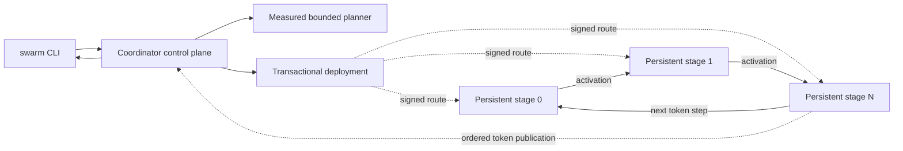

# Swarm Inference Lab

**Run one model across the hardware already on your private network.**

Swarm Inference Lab turns a mix of CPU and GPU machines into a self-configuring inference
cluster. Install the same release on each machine, create a cluster, paste one join command, and
run a model. Swarm measures the available hardware and network links, chooses a placement for the
requested goal, prepares only the model stages each node needs, and streams the result back to
the terminal.

The first supported product model family is
[OLMoE](https://huggingface.co/allenai/OLMoE-1B-7B-0125-Instruct). Swarm is currently a release
candidate and is best suited to evaluation on hardware you control.

> [!IMPORTANT]
> Swarm is designed for a **trusted LAN or private network**. Pairing authenticates nodes and
> pins their identities, but **inference data-plane payloads are not encrypted**. Do not expose
> Swarm ports to the public Internet or use untrusted nodes for sensitive prompts or weights.

## What you get

- **One user workflow:** `swarm cluster create`, `swarm node join`, and `swarm run` cover normal
  setup and inference without hand-written topology files.
- **Hardware-aware planning:** CPU, CUDA, and Apple MPS probes, usable memory, and directed
  network measurements inform every plan.
- **A goal that matches the job:** optimize interactive speed or aggregate throughput, pool
  memory for model fit, or balance speed, headroom, reliability, and node participation.
- **Stage-owned model storage:** participating nodes receive only the tensors and metadata owned
  by their stage, not a complete model snapshot.
- **Persistent serving:** node agents, model stages, connections, and queues stay alive across
  requests instead of being rebuilt for every prompt.
- **Inspectable decisions:** preview a plan before downloading or deploying anything, and use
  JSON or NDJSON output for automation.

## Before you start

For the normal two-machine path you need:

- two machines on the same routable private network;
- the same Swarm release installed on both machines;
- Windows 11 x86-64 for the native installer workflow below; and
- enough combined memory and storage for the selected OLMoE revision.

Swarm can leave a slow node idle when that produces a better plan. Adding a machine does not
guarantee lower latency.

## Install on Windows

You do not need Git, Python, `uv`, a repository checkout, or an administrator terminal.

1. Open [GitHub Releases](https://github.com/mmprotest/swarm-inference-lab/releases).
2. Download `SwarmInferenceSetup-x64.exe` from the release you want to use.
3. Double-click the installer and complete the per-user setup.
4. Open a new PowerShell or Command Prompt window.
5. Verify the installation:

```powershell
swarm --version
swarm node doctor
```

The installer selects CUDA only after the installed runtime passes a real CUDA tensor check. If
automatic CUDA validation fails, setup falls back transactionally to the locked CPU profile.
Setup does not create a cluster service until you create or join a cluster.

See [Windows installation](docs/windows-installation.md) for repair, update, silent-install, and
uninstall behavior.

## Cluster quick start

Run these commands with private, routable addresses. Swarm chooses identities, ports, backend,
dtype, memory limits, and storage budgets automatically.

### 1. Create a cluster

On the machine that will coordinate the cluster:

```powershell
swarm cluster create --name villani-home
```

The command prints one complete, single-use join command. Treat it like a short-lived password:
do not save it in logs or screenshots.

### 2. Join another machine

Paste the printed command into a terminal on the second machine:

```powershell
swarm node join "swarm://<private-address>:<port>/join/<single-use-data>"
```

Joining verifies both identities, starts the user-scoped node service, checks bidirectional
reachability, benchmarks the selected device and dtype, and measures the links between nodes.

### 3. Check readiness

Back on the coordinator:

```powershell
swarm cluster status
```

A node that cannot be reached remains `blocked` and is not silently treated as ready. Run
`swarm node doctor` on a node for local backend diagnostics.

### 4. Preview the placement

Planning can be inspected without artifact preparation or deployment:

```powershell
swarm run allenai/OLMoE-1B-7B-0125-Instruct `
  --revision b89a7c4bc24fb9e55ce2543c9458ce0ca5c4650e `
  --tokenizer-revision sha256:d1e645ebd850d79567e531a3c103ac575d8e9cf45fa941420afc584b293438ea `
  --mode speed `
  --prompt "Explain distributed inference." `
  --dry-run --explain-plan
```

Model and tokenizer revisions are explicit and immutable so that artifact identity, deployment,
and recovery all refer to the same inputs.

### 5. Run inference

Remove the preview flags when the plan looks right:

```powershell
swarm run allenai/OLMoE-1B-7B-0125-Instruct `
  --revision b89a7c4bc24fb9e55ce2543c9458ce0ca5c4650e `
  --tokenizer-revision sha256:d1e645ebd850d79567e531a3c103ac575d8e9cf45fa941420afc584b293438ea `
  --mode speed `
  --prompt "Explain distributed inference."
```

The first run may need to acquire the immutable model revision and prepare stage artifacts.
Verified artifacts and loaded stages are reused by later requests.

### Choose a planning mode

| Mode | Use it when | Planner behavior |
|---|---|---|
| `speed` | You want the lowest predicted latency | Compares distributed candidates with the fastest feasible local route; slower joined nodes may remain idle. |
| `throughput` | You expect concurrent requests | Favors the route with the highest predicted aggregate token throughput. |
| `capacity` | The model does not fit on the best single node | Uses collectively available memory to find a feasible route. |
| `balanced` | You want a tunable compromise | Weighs throughput, memory headroom, reliability, and useful participation. |

Use `--require-node <node-id>` or `--exclude-node <node-id>` when placement must include or avoid
a particular node. See the full [cluster quick start](docs/cluster-quickstart.md) and
[troubleshooting guide](docs/cluster-troubleshooting.md) for firewall and readiness help.

## Product architecture

Swarm separates coordination from model-data movement:



The coordinator owns membership, health, planning, deployment, session admission, recovery, and
ordered token publication. Once a request is admitted, hidden-state activations travel directly
between the assigned stages. The coordinator is absent from steady-state hidden-state
forwarding.

### Key architectural decisions

| Decision | Why it was chosen | User-visible consequence |
|---|---|---|
| Separate coordinator control plane from the direct stage-ring data plane | Keep centralized policy and durable request state without relaying every activation through one process. | Coordinator and stage traffic use separate endpoints and failure domains; the coordinator is still required for admission and token commit. |
| Keep node agents, stages, and peer connections persistent | Model loading and connection setup are expensive compared with a request. | Warm artifacts and stages are reused, reducing repeated setup work. Services run in the current user's session rather than as cluster-wide system services. |
| Plan from measured capabilities with a deterministic bounded search | Heterogeneous clusters cannot be placed well from device labels alone, while factorial worker permutations do not scale. | Hardware probes, memory budgets, and fresh directed-link measurements feed explainable `speed`, `throughput`, `capacity`, and `balanced` plans. |
| Assign contiguous stages and build content-addressed, stage-owned artifacts | Make ownership verifiable and avoid requiring every participant to retain the whole model. | A stage receives only its assigned tensors plus required metadata; incomplete or hash-mismatched transfers are never loaded. |
| Deploy transactionally using signed, immutable route generations | A partially loaded or ambiguous topology is unsafe to serve. | Reservations, artifact verification, loads, routes, and peer checks must all succeed before a route becomes ready; failed deployment rolls back. |
| Recover by retiring the failed generation and replaying verified history | Moving live KV caches across heterogeneous workers is complex and not yet supported. | Recovery is **restart-and-replay, not seamless failover**. It recomputes the prompt and accepted greedy-token prefix and fails closed on divergence. |
| Interleave bounded per-session work without merging request tensors | Preserve isolated KV state and predictable queue bounds across different stages and backends. | Multiple sessions can make progress concurrently, but this is **not continuous tensor batching**. |
| Authenticate membership and routes while keeping a trusted-network boundary | Strong onboarding and route integrity can be provided independently of a fully encrypted data plane. | Pairing, signed leases, and peer handshakes reject unknown or stale participants, but prompts and activations still require a network you trust. |

For protocol and component detail, see [Architecture](docs/architecture.md),
[Pairing](docs/pairing.md), [Model artifacts](docs/model-artifacts.md), and
[Recovery](docs/recovery.md).

## Everyday operation

```text
swarm cluster status             # cluster membership and readiness
swarm node status                # this node's service and membership state
swarm node doctor                # backend and environment diagnostics
swarm run ... --dry-run --explain-plan
swarm update                     # check and install a verified Windows release
```

Use `--json` for a final machine-readable document and `--ndjson` for progress or token streams.
Machine-readable output excludes pairing secrets and prompt contents. For automation, pairing
invitations are written atomically to an owner-protected file rather than returned in JSON.
Non-interactive administrative mutations require `--yes` and fail before changing state when it
is absent.

Advanced diagnostic and acceptance commands remain available under `swarm coordinator`,
`swarm worker`, `swarm identity`, `swarm model`, `swarm submit`, `swarm status`, `swarm workers`,
`swarm topology`, `swarm sessions`, and `swarm cancel`. They are not required for normal cluster
bootstrap. Their contracts are documented in [Product runtime](docs/product-runtime.md).

## Support and current limits

| Platform | Product implementation | Normal installation path |
|---|---|---|
| Windows 11 x86-64 | Implemented for CPU and operational CUDA | Native per-user setup executable |
| Linux x86-64 / ARM64 | Runtime and service adapters implemented | Repository/developer installation |
| macOS ARM64 | Runtime and service adapters implemented for MPS or CPU | Repository/developer installation |
| Windows ARM64, macOS Intel, 32-bit systems | Unsupported | None |

Implementation is not the same as validation. A successful device probe selects an operational
backend; it does not manufacture retained software or physical evidence. **Physical
multi-machine product performance has not been proven** in this repository state. Loopback,
simulation, and CI results are useful engineering evidence but do not demonstrate real network
scaling.

Other important limits:

- OLMoE is the only supported product model family for this milestone.
- The coordinator is a control-plane and token-commit dependency and is not highly available.
- Recovery supports verified greedy-token replay; it does not migrate KV caches.
- Nodes and network observers can inspect the plaintext inference data available to them.
- Slow devices can reduce single-request performance or contribute no useful work.
- Experiment 011 remains the latest completed experiment. Later model-family work and retained
  experiment paths are research inputs, not product support claims.

See [Platform support](docs/platform-support.md), [Security boundary](docs/security-boundary.md),
and [Limitations](docs/limitations.md) before using Swarm with valuable data or hardware.

## Developer, CI and offline recovery installation

The cross-platform shell installers are intended for repository development, CI, offline wheel
recovery, and platforms without the native Windows setup. They are not the normal Windows user
path:

```powershell
powershell -ExecutionPolicy Bypass -File .\scripts\install.ps1 `
  -SourceWheel .\dist\swarm_inference_lab-0.1.0rc11-py3-none-any.whl -Json
```

```bash
sh ./scripts/install.sh \
  --source-wheel ./dist/swarm_inference_lab-0.1.0rc11-py3-none-any.whl \
  --json
```

The supported repository validation workflow is documented in
[Physical two-machine acceptance](docs/physical-two-machine-acceptance.md) and the release
process in [Releasing](docs/releasing.md).

## Documentation

- [Cluster quick start](docs/cluster-quickstart.md)
- [Windows installation](docs/windows-installation.md)
- [Cluster troubleshooting](docs/cluster-troubleshooting.md)
- [Node agent](docs/node-agent.md)
- [Platform support](docs/platform-support.md)
- [Product runtime](docs/product-runtime.md)
- [Architecture](docs/architecture.md)
- [Pairing and identity](docs/pairing.md)
- [Security boundary](docs/security-boundary.md)
- [Model artifacts](docs/model-artifacts.md)
- [Recovery](docs/recovery.md)
- [Limitations](docs/limitations.md)

## License

Apache-2.0. See [LICENSE](LICENSE).
