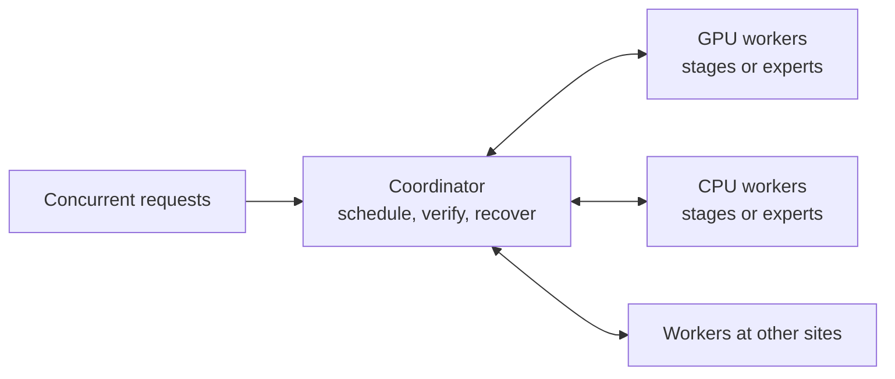

# Swarm Inference Lab

> Researching whether computers around the world can work together as one AI
> inference system.

Swarm Inference Lab is an open-source prototype for **global distributed
inference**. The aim is to pool heterogeneous CPUs, GPUs, memory, and storage so
they can serve models or workloads that no participating machine could handle
alone.

This is a model-agnostic infrastructure project. It is **not a Kimi K3
implementation**. Qwen, OLMoE, and Kimi-shaped workloads are test vehicles for
different parts of the distributed system.

## What the project is trying to prove

The core research question is:

> Can geographically distributed machines collectively host a model larger
> than any one node and increase verified output throughput as useful nodes are
> added, despite latency, uneven hardware, churn, failures, and incorrect
> workers?

Success has three parts:

1. **Capacity:** model stages or experts can be split across machines.
2. **Useful scaling:** adding suitable machines increases aggregate verified
   throughput across concurrent requests.
3. **Correctness and resilience:** the system detects bad results and survives
   realistic worker failures without silently corrupting output.

The goal is not necessarily to make one prompt faster. A distributed network
may increase total serving capacity while adding latency to an individual
request.

## Current status - August 2026

**The prototype works on one machine. The global scaling hypothesis is not yet
proven.**

### Working today

- A deterministic simulator models heterogeneous nodes, LAN/WAN links, replica
  placement, workload-aware scheduling, churn, and adversarial workers.
- Independent worker processes exchange real gRPC activations and expert
  results through bounded queues, with replay, signatures, audits, quarantine,
  and clean shutdown.
- Dense Qwen3-0.6B stage partitioning matches a separate full-model reference
  on native Windows CPU and RTX 5090 CUDA.
- Real Colibri OLMoE inference consumes whole-expert and native-microshard
  results from separate worker processes while preserving exact tokens and
  internal numerical boundaries.
- The physical experiment runner and cross-platform worker entry point are
  implemented. Windows is the exercised hardware platform; Linux x86-64,
  Linux ARM64, and macOS paths still need full target-hardware validation.
- Every standard run produces machine-readable provenance, metrics, acceptance
  results, charts, an offline report, and artifact hashes.

### Not yet demonstrated

- a completed inference run across two or more physical machines;
- positive scaling over a real LAN or WAN;
- a complete current over-VRAM Level B run with all correctness and performance
  gates passing;
- Kimi K3 checkpoint execution; or
- a secure production network for untrusted Internet workers.

### Latest result: Experiment 010

Experiment 010 exercised a hardware-in-the-loop virtual swarm on one Windows
workstation. Separate native expert workers matched 1,600/1,600 whole-expert
tokens and 640/640 microshard tokens. All recoverable cases in an eight-scenario
failure matrix remained exact, and all 120 scheduled corruptions were detected
with zero false positives across 14,484 clean controls.

The distributed configurations were correct but slower than local execution on
that workstation: local decode measured 5.26 tokens/s versus roughly 2.81-2.95
tokens/s for the exact distributed paths. The planner correctly chose local
execution for ordinary decode and distributed execution only for the capacity
objective.

The official result is therefore `PARTIAL` / `INCOMPLETE_FULL_RUN`: the
single-workstation software gates pass, but the required current over-VRAM
Level B workload was unavailable and no physical multi-machine run exists. 

## How the system works

The coordinator owns placement, routing, verification, and recovery. Workers
host only their assigned model stages or experts.



For each request:

1. workers register their measured capabilities, identity, endpoint, and model
   partitions;
2. the planner chooses a route using compute time, queue depth, network cost,
   reliability, and workload priority;
3. selected workers execute their stages or experts and return activations or
   expert results;
4. the coordinator verifies and commits output; and
5. failed work is replayed to a compatible replica when recovery is possible.

A slow or unreliable node is not forced into a route merely because it is
available. The scheduler can leave nodes idle when they would reduce useful
throughput.

The centralized coordinator is intentional at this stage. It keeps the scaling
experiment measurable before decentralized discovery or consensus adds more
failure modes.

## Where the model names fit

- **Qwen3-0.6B** tests dense stage partitioning.
- **OLMoE-1B-7B** tests real sparse-expert distribution.
- **Qwen3-Next** supplied the historical over-VRAM workload. It generated text
  with 45.081 GiB of Q4_K_M tensors across GPU and system RAM, but its
  correctness and adaptive-performance gates failed.
- **Kimi K3** is only a future feasibility target. The repository has a
  compiled synthetic K3-shaped MXFP4 fixture, not Kimi K3 inference or model
  support.

Future models matter only insofar as they test the general distributed
inference design.

## Quick start

Python 3.11 is required. The synthetic path needs neither PyTorch nor a model
download.

Windows PowerShell:

```powershell
.\scripts\bootstrap.ps1 -Backend synthetic
.\.venv\Scripts\swarm.exe simulate --config configs/experiments/smoke.yaml
```

Linux or macOS:

```bash
bash scripts/bootstrap.sh --backend synthetic
.venv/bin/swarm simulate --config configs/experiments/smoke.yaml
```

Use `cpu`, `cuda`, or `mps` instead of `synthetic` to install a supported real
model backend. The smoke command writes a report and may return `FAIL` when an
acceptance threshold is missed; that is a valid experimental result, not a
crashed installation.

Run four process-isolated workers on the local machine after activating the
virtual environment:

```bash
swarm experiment --config configs/experiments/scaling_loopback.yaml --workers 4
```

That command tests the runtime, not physical scaling. For separate machines,
follow the [physical-node procedure](docs/physical_nodes.md); the runner rejects
same-host workers when a physical result is requested.

## Reproducing real-model work

- [Dense Qwen stage correctness](docs/experiment-002-real-qwen3.md)
- [Colibri expert runtime](experiments/009_colibri_adaptive_expert_runtime/README.md)
- [Latest virtual-swarm closure](experiments/010_hardware_in_loop_virtual_swarm_closure/README.md)

Model downloads and checkpoint revisions are always explicit. A distributed
validation run does not silently load a full reference model into a worker or
coordinator; reference validation runs separately and is disclosed.

## Evidence rules

Every result says what actually ran:

- `simulation` models behavior from measured or declared inputs;
- `single-host-loopback` uses real processes and transport on one machine;
- `physical-lan` requires separate machines on a real local network; and
- `physical-wan` requires separate machines on a real wide-area network.

Only committed tokens from completed and verified requests count toward the
primary throughput metric. A failed gate stays `FAIL`, and an unrun gate is
never converted into a pass.

## Next milestone

The next decisive experiment is the exact expert path on at least two
independently powered hosts. It must show whether any distributed placement has
positive utility after real NIC, storage, synchronization, thermal, and failure
domain costs are included. If that works on a LAN, the project can move toward
geographically separated WAN nodes.

Until then, this repository demonstrates distributed-inference mechanisms and
single-host correctness - not a working global inference network.

## Documentation

- [Architecture](docs/architecture.md)
- [Protocol](docs/protocol.md)
- [Product runtime operations](docs/product-runtime.md)
- [Experiment design](docs/experiments.md)
- [Known limitations](docs/limitations.md)

Source code is under [`src/swarm_inference`](src/swarm_inference), experiment
configurations are under [`configs`](configs), and checked-in reference evidence
is under [`artifacts`](artifacts).

## Security boundary

Do not expose the runtime to the public Internet or send sensitive prompts to
untrusted workers. Product routes and direct stage peers authenticate each
other with Ed25519 identities, but stage-ring traffic is not encrypted. The
supported boundary is a trusted LAN or private network. Workers can inspect
their input activations and cache state. Signatures and duplicate audits do not
provide channel confidentiality, prompt privacy, activation privacy, Byzantine
fault tolerance, collusion resistance, or cryptographic proof of neural
computation.

## License

Apache License 2.0. See [LICENSE](LICENSE).
