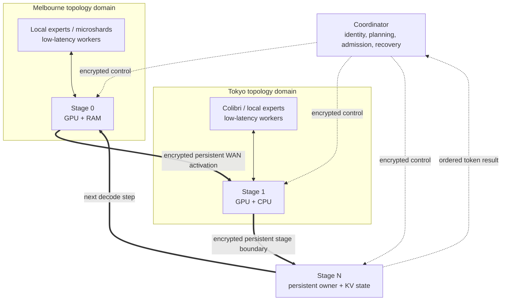

# Swarm Inference Lab

Swarm Inference Lab is a general-purpose distributed inference runtime for open-weight models.
It resolves Hugging Face or local artifacts, inspects architecture and format metadata, probes
the engines installed across a heterogeneous swarm, and selects a measured feasible plan. It is
experimental systems software for NVIDIA GPUs, Apple Silicon, CPUs, and real networks including
WAN links.

The long-term product objective is general-purpose global WAN inference across open-weight model
families, artifact formats, operating systems, accelerators, and execution engines.

The core thesis is simple: slow links need coarse, persistent execution boundaries. Across a
WAN, Swarm moves activations between contiguous model stages instead of turning every layer or
expert into an RPC. Inside a measured low-latency domain, the planner may use finer mechanisms
such as whole experts or microshards when they have positive utility.

> [!NOTE]
> Swarm Inference Lab is active experimental systems software, not a production service.
> The canonical runtime implements heterogeneous worker discovery, multiple inference engines,
> topology-aware planning, authenticated encrypted WAN transport, and persistent stage
> execution. Physical multi-machine performance validation remains ongoing.

## What exists today

- One product workflow: `swarm cluster create`, `swarm node join`, and `swarm run`.
- A model resolver for immutable Hugging Face revisions and local checkpoints, including GGUF
  variant discovery and worker-managed artifacts.
- An open architecture-profile registry covering major Kimi, Qwen, GLM, DeepSeek, MiniMax,
  Llama, Mistral/Mixtral, and Gemma layout families without repository-name dispatch.
- Architecture-owned tensor, attention, routing, expert, tied-weight, and shard semantics;
  engines consume the resulting profile instead of model-family branches.
- Three canonical engines: native stage, Colibri, and llama.cpp RPC.
- CPU, CUDA, and MPS capability detection with explicit RAM/VRAM admission.
- Measured topology domains based on RTT, bandwidth, jitter, and connection stability.
- Direct persistent stage-to-stage data flow; the coordinator does not relay hidden states.
- TLS 1.3 transport bound to durable cluster identities, plus signed control messages and
  fail-closed peer validation.
- Exact byte and connection telemetry around Swarm-managed llama.cpp RPC links.
- Probe-generated compatibility records, measured engine competition, and strict `--engine` /
  `--require-distributed` semantics.

Adding a node does not guarantee lower latency. In `speed` mode a weak node may remain idle;
`capacity` mode can include it when its memory is necessary.

## Install

A participating node installs a release; it does not need a repository clone.

- **Windows 11 x86-64:** install `SwarmInferenceSetup-x64.exe` from the project’s
  [GitHub Releases](https://github.com/mmprotest/swarm-inference-lab/releases). The per-user
  installer contains the application, locked dependency profile, and pinned engine artifacts.
- **Linux and macOS:** install the released wheel/package with the release `install.sh`. The
  script provisions a managed Python environment and selects CPU, CUDA, or MPS after an
  operational probe.

After installation:

```bash
swarm --version
swarm node doctor
```

Windows, Linux x86-64/ARM64, and macOS ARM64 runtime adapters exist. Backend detection is not a
physical performance claim; the acceptance report keeps software and hardware evidence
separate.

### Developer, CI and offline recovery installation

Offline/recovery workflows can pass a downloaded wheel to `install.ps1 -SourceWheel ...` or
`install.sh --source-wheel ...`. These repository scripts are for development, CI, and recovery;
normal Windows nodes use the signed release installer above.

## Cluster quick start

On the coordinator:

```bash
swarm cluster create --name my-swarm
```

The command prints a short-lived, single-use pairing URI. On another independently installed
node:

```bash
swarm node join "<pairing-uri>"
```

Inspect readiness, then use the general model interface:

```bash
swarm cluster status

swarm run <hugging-face-model-or-local-model> \
  --mode speed \
  --prompt "Explain distributed inference."
```

Inspect a genuinely distributed plan before acquisition or deployment:

```bash
swarm run <model> \
  --require-distributed \
  --dry-run \
  --explain-plan \
  --prompt "Hello"
```

Explicit engine requests fail if that engine does not pass model/runtime/hardware preflight:

```bash
swarm run <model> --engine native-stage --prompt "Hello"
swarm run <model> --engine colibri --prompt "Hello"
swarm run <model> --engine llamacpp-rpc --prompt "Hello"
```

Only automatic selection (omit `--engine`) may choose among compatible engines. Likewise,
`--require-distributed` fails unless required computation is placed on at least two physical
hosts; it never silently runs the complete model on the coordinator.

## Product architecture



The coordinator owns membership, capability collection, engine competition, deployment,
session admission, and ordered result publication. Persistent workers own their model stages
and KV state. Once admitted, activations travel directly through the stage ring; the coordinator
is outside the steady-state activation path.

Architecture description is separate from engine selection:

```text
HF/local model -> immutable resolver -> architecture profile + artifact profile
                                      | attention and layer layout
                                      | routed/shared expert descriptors
                                      | tensor roles and shard reductions
                                      ` quantization and modalities

profile + worker capabilities + topology -> structured engine probes
                                          | Colibri sparse-MoE/full-model paths
                                          | native-stage contiguous paths
                                          ` llama.cpp GGUF/RPC paths
                                                     |
                                             measured plan competition
```

Built-in profiles cover architecture families rather than checkpoint repository names. New
checkpoints that retain an implemented metadata/tensor contract can work without coordinator or
planner changes. Historical experiment models remain evidence fixtures only.

## Execution engines

### Native stage runtime

The native engine partitions supported safetensors checkpoints into persistent contiguous
stages. It builds stage-owned artifacts, keeps KV caches isolated per request and stage, and uses
direct stage-to-stage connections. This is the Experiment 011-derived WAN-efficient path.

The complete native-stage registry currently contains:

- `qwen3_dense`
- `qwen3_moe` for the Transformers `qwen3_moe` safetensors representation
- an isolated compatibility adapter retained for the original experiment checkpoint

Dense Qwen3 retains its optimized CUDA execution path. Sparse Qwen3 layers keep their router and
all experts with the layer-owning stage. The current native adapter does **not** claim the newer
Qwen3.5/Qwen3.6 hybrid `qwen3_5_moe` representation; that representation fails native preflight
with an actionable error rather than being forced through an incompatible Python path.

### Colibri

Colibri is a high-performance execution engine used for compatible sparse-MoE computation,
selected automatically when it provides a viable execution plan. Swarm pins Colibri v1.4.0 at
commit `b085b48888a88d9a1c00b151a9979774b72cdbfd` and applies a reproducible patch series. Native
complete-model adapters cover the pinned GLM and Kimi K3 paths. A Swarm-owned generic sparse-MoE
component adds adapter-described routing, expert residency/tiering, expert placement, exact
weighted accumulation, and microshard semantics for Qwen MoE, Kimi K2, DeepSeek, MiniMax,
Mixtral, Llama 4 MoE, and Mistral 4 MoE layouts.

A component probe is reported as such; it is not promoted to a complete plan until attention,
KV cache, tokenization, sampling, and every other required capability are supplied. The generic
component has an exact symmetric INT4-G32 decode/compute path for adapter-proved compressed
tensors; other packed int4/int8 layouts are rejected until a matching quantization kernel is
installed. Colibri is scored against other complete plans from measured throughput and resource
costs—it is never selected merely because an adapter exists.

### llama.cpp RPC

llama.cpp RPC is the broad GGUF compatibility/capacity engine. Workers advertise a hash-bound,
pinned llama.cpp build. Before deployment, Swarm checks the resolved GGUF architecture against
loader identifiers actually present in or advertised by that build. This is an engine
capability probe, not a filename or Hugging Face repository allowlist.

llama.cpp RPC may perform finer tensor RPC than the native stage path, so the planner includes
its network behavior explicitly. WAN tensor-RPC plans are penalized and admitted for capacity or
an explicit distributed requirement when appropriate; they are not presented as equivalent to
the coarse native stage ring. Swarm’s transparent TLS metering links record exact bytes,
connections, transfers, duration, and bytes per generated token without modifying the llama.cpp
protocol. Private-protocol message counts remain `unknown` unless observable.

## Model support matrix

Support is generated from structured probes, not a model-name allowlist. The current high-level
summary is:

| Artifact/profile | Native stage | Colibri | llama.cpp RPC |
| --- | --- | --- | --- |
| Qwen3 dense or MoE Safetensors | Complete | MoE component where applicable | Not applicable |
| Kimi K3 native MXFP4 Safetensors | No | Complete text path | Not applicable |
| GLM MoE/DSA Safetensors | No | Complete | Not applicable |
| Qwen3.5/3.6, Kimi K2, DeepSeek, MiniMax, Mixtral and newer MoE Safetensors | No complete path yet | Routed-expert component; hybrid completion pending | Not applicable |
| Llama, Mistral, Gemma and other compatible GGUF | No | No | Complete only when the exact pinned runtime proves support |
| Qwen3.6-35B-A3B GGUF | No | Unsupported format | Complete only when the runtime proves `qwen35moe` plus the selected quantization |

Architecture inspection is broader than complete execution. `NOT_TESTED` is never rewritten as
`UNSUPPORTED`, and component support is never presented as full-model validation. See the
detailed, evidence-scoped [model support registry](docs/model-support.md).

Maintainers can profile current checkpoints without acquiring their weights:

```powershell
uv run python scripts/inspect_model_compatibility.py `
  Qwen/Qwen3.6-35B-A3B `
  moonshotai/Kimi-K3 `
  zai-org/GLM-5 `
  deepseek-ai/DeepSeek-V3.2
```

## Qwen3.6 GGUF example

The motivating repository is
[`unsloth/Qwen3.6-35B-A3B-GGUF`](https://huggingface.co/unsloth/Qwen3.6-35B-A3B-GGUF).
Its `UD-Q4_K_M` variant is approximately 22 GB, so choose a quantization that actually fits the
participating workers.

First inspect the exact plan. GGUF uses `llamacpp-rpc`, not the native Python stage adapter:

```bash
swarm run unsloth/Qwen3.6-35B-A3B-GGUF \
  --quant UD-Q4_K_M \
  --engine llamacpp-rpc \
  --mode capacity \
  --require-distributed \
  --dry-run \
  --explain-plan \
  --prompt "Hello"
```

Preflight reports the immutable revision, selected GGUF files, `qwen3_5_moe` architecture and
raw `qwen35moe` loader identity where available, the pinned llama.cpp runtime evidence, every
participating/excluded worker, tensor ownership, topology, and measured versus unknown network
costs. If the installed llama.cpp build does not support `qwen35moe`, the command stops here.

Run after reviewing the plan:

```bash
swarm run unsloth/Qwen3.6-35B-A3B-GGUF \
  --quant UD-Q4_K_M \
  --engine llamacpp-rpc \
  --mode capacity \
  --require-distributed \
  --prompt "Explain why WAN inference needs coarse boundaries."
```

The real 35B download and hardware execution are intentionally opt-in; ordinary CI uses small
metadata and model fixtures.

## Kimi, GLM, and DeepSeek examples

The same interface inspects and probes current major MoE checkpoints. These examples use dry-run
because the models are enormous and a successful plan depends on the exact installed Colibri
runtime, quantization, memory, and worker topology:

```powershell
swarm run moonshotai/Kimi-K3 --dry-run --explain-plan --prompt "Hello"
swarm run zai-org/GLM-5 --dry-run --explain-plan --prompt "Hello"
swarm run deepseek-ai/DeepSeek-V3.2 --dry-run --explain-plan --prompt "Hello"
```

Kimi K3 and GLM can produce complete pinned-Colibri candidates when the matching runtime and
artifact contract are present. DeepSeek V3.2 currently reports architecture-aware MLA,
grouped-routing, shared-expert, and routed-expert metadata plus a Colibri component result; it
does not claim a complete Safetensors plan until the hybrid MLA/KV path is integrated. A
compatible DeepSeek GGUF may instead be selected through a runtime-proved llama.cpp path.

## WAN behavior

Swarm classifies directed worker relationships from measured RTT, bandwidth, jitter, and
stability, rather than geography.

- Low-latency domains may consider more boundaries, expert parallelism, and microshards.
- WAN domains favor contiguous stages, persistent connections, and few serial crossings.
- `speed` compares a distributed route with the best feasible local route and can exclude a
  slow node.
- `capacity` can accept a slower node when collective memory is required.
- Communication estimates include bytes/token, operations/token, WAN boundaries, persistent
  connection use, and confidence/provenance. `unknown` is never encoded as zero.

Experiment 010 established useful whole-expert and microshard mechanisms, but also showed why
fine-grained synchronous RPC cannot be spread blindly over slow links. Experiment 011 moved the
WAN abstraction to persistent contiguous stages and removed the coordinator from hidden-state
forwarding. The canonical runtime preserves that transition.

Swarm does not currently provide automatic NAT traversal or a relay service. Operators must
provide routable endpoints (directly or through their chosen network overlay) and configure
firewalls for the selected ports.

## Security and trust model

Pairing uses a short-lived, single-use invitation only for onboarding. Each worker node creates
and retains its own durable Ed25519 identity and independently rotatable TLS private key;
private keys are never sent to another node. The coordinator issues cluster-scoped certificates
whose TLS public keys are cryptographically bound to trusted node identity fingerprints.

WAN control and data channels use TLS 1.3. Stage-ring, expert, network-probe, worker-control,
peer, token/result, and Swarm-managed llama.cpp RPC connections validate the cluster CA and
expected durable peer identity. Long-lived coordinator requests also carry signed
identity-bound authentication.
Unknown, revoked, expired, wrongly certified, tampered, or plaintext remote peers are rejected
before inference traffic is accepted. Loopback plaintext is available only as an explicit
development/test transport. Certificates are replaceable without recreating the cluster;
rotation policy is separate from the one-time pairing credential.

To rotate a worker transport key without changing its durable cluster identity, create a fresh
single-use pairing URI on the coordinator and rejoin with
`swarm node join "<pairing-uri>" --rotate-transport-key`. The new key remains on that worker;
only its public key and replacement certificate cross the network.

This protects traffic in transit and blocks trivial network MITM attacks. It does **not** solve:

- malicious participating workers returning incorrect computation;
- Byzantine consensus or malicious-compute verification;
- privacy from a trusted node that legitimately owns a model stage and sees its inputs;
- anonymity or permissionless public compute.

Use only nodes whose operators and software you trust for the model data assigned to them.

## Planning and operation

Planning modes are:

| Mode | Objective |
| --- | --- |
| `speed` | Lowest predicted interactive latency; excludes negative-utility nodes |
| `throughput` | Highest predicted aggregate service rate for concurrent requests |
| `capacity` | Feasible collective memory, accepting latency tradeoffs explicitly |
| `balanced` | Weighted speed, headroom, reliability, and useful participation |

`swarm run --dry-run --explain-plan` reports model identity/size, architecture source, every
engine compatibility result, selection reason, worker inclusion/exclusion, stage and model-byte
ownership, device/memory estimates, topology, WAN boundaries, communication estimates with
provenance, and whether a required distributed plan was actually achieved.

Useful commands:

```text
swarm cluster status
swarm node status
swarm node doctor
swarm run ... --dry-run --explain-plan
swarm update
```

Use `--json` for one final machine document and `--ndjson` for progress/token streams. Pairing
secrets and prompts are excluded from status and normal machine output.

## Pre-physical acceptance

From a development checkout, run the software-only gate immediately before using real hosts:

```powershell
uv run python scripts/run_pre_physical_acceptance.py
```

It validates model/engine preflight, universal architecture profiles, Qwen3 staging, generic
Colibri routing/expert computation, registry preservation, no silent fallback, WAN-aware
planning, network telemetry, secure control/data paths, README commands, and wheel installation.
It reports real hardware and network gates as `NOT_RUN`; it never promotes loopback or fixture
results to physical evidence.

Normal repository validation also includes:

```powershell
uv run ruff format src tests
uv run ruff check src tests
uv run mypy
uv run pytest tests/unit
uv run pytest tests/integration
uv run pytest tests/failure
```

## Current limitations

- This is experimental software; physical heterogeneous and WAN performance validation is still
  operator work.
- The coordinator is a control-plane/token-commit dependency and is not highly available.
- Recovery is verified restart-and-replay for greedy decoding; live KV migration is not
  implemented.
- Fine-grained expert/microshard execution is restricted to suitable topology domains and exact
  model/quantization identity.
- Native Qwen3 MoE supports the Transformers `qwen3_moe` representation. Qwen3.5/Qwen3.6,
  Kimi K2, DeepSeek, MiniMax, and newer Mistral-family MoE Safetensors layouts have implemented
  profiles and Colibri routed-expert components, but several still lack a complete hybrid
  attention/KV execution plan.
- Dense Llama, Mistral, and Gemma Safetensors profiles are inspectable but do not yet have a
  generic native-stage implementation; use an exact runtime-probed GGUF path where available.
- llama.cpp compatibility is limited to loader/features proven by the installed pinned build.
- No claim is made that adding nodes improves latency, or that Swarm outperforms centralized
  inference for every model/topology.

Further detail: [architecture](docs/architecture.md), [model support](docs/model-support.md),
[security boundary](docs/security-boundary.md), [model artifacts](docs/model-artifacts.md), [recovery](docs/recovery.md),
[platform support](docs/platform-support.md), and
[physical two-machine acceptance](docs/physical-two-machine-acceptance.md).
