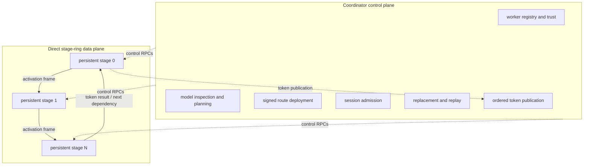

# Product architecture

The canonical product has a coordinator control plane and a direct stage-ring data plane. This
document describes the product path; older coordinator-relayed experiment paths are historical
baselines, not the primary architecture.

The coordinator is not on the steady-state hidden-state forwarding path. It starts sessions at
stage zero and receives bounded token publications; stage-boundary activations move directly
between authenticated peers. Coordinator gRPC and stage-ring TCP therefore have separate
endpoints and failure domains.

## Coordinator control plane

The coordinator owns:

- durable Ed25519 route authority and worker trust decisions;
- registration and heartbeat health;
- exact model/revision inspection and measured placement planning;
- transactional stage load, route installation, admission, cancellation, and unload;
- route-generation retirement and compatible replacement selection;
- durable request state and accepted-token replay logs; and
- ordered publication, duplicate suppression, and client streaming.

It does not load the full distributed model and does not relay product hidden states. Reference
models are allowed only in separately disclosed validation processes.

## Persistent workers and stage ownership

A worker advertises separate control and data endpoints, protocol/backend support, resource
limits, an Ed25519 public key, and measured capacity. Deployment assigns a contiguous stage and
loads it once. The loaded stage, weights, queues, and service processes persist across requests;
session-local KV state is opened and released independently.

Architecture profiles are resolved independently from the engine registry. The native-stage
registry currently provides complete Qwen3 dense and Qwen3 MoE stage implementations; other
families may use complete Colibri or runtime-probed GGUF plans, while component-only results are
retained for future hybrid composition. Stage zero owns adapter-described embeddings and input
token handling; intermediate stages own contiguous decoder layers; the last stage owns
adapter-described final normalization and output projection. For sparse models, routed/shared
expert ownership comes from `ExpertDescriptor` records. Exact ownership is part of the signed
route.

Whole-expert and native microshard execution are optional, canonical backends within a stage.
They use coordinator-planned expert ownership and direct expert transport, but do not introduce a
second product coordinator, protocol family, or inference runtime.

## Direct protocol and route generations

Each stage-ring frame carries the topology, route generation, session, request, operation,
source/destination stage, token position, and sequence number. Frames use bounded metadata and
payload lengths plus SHA-256 corruption detection. Persistent peer connections are ordered and
poisoned connections are evicted after EOF, reset, broken pipe, integrity failure, or timeout.

The coordinator signs finite route leases containing worker identities, endpoints, model and
tokenizer revisions, assignments, generation, and nonce. Workers pin the coordinator identity
and verify the lease. Direct peers then authenticate the expected worker identity before using a
connection. Old-generation frames and publications are rejected after replacement.

Canonical remote stage connections use mutually authenticated TLS 1.3 in addition to signed
leases and peer handshakes. See [Security boundary](security-boundary.md).

## Topology domains

Planning classifies measured directed links from RTT, bandwidth, jitter, and connection
stability. Low-latency domains may admit more stage boundaries, whole-expert work, or
microshards. WAN domains prefer persistent contiguous stages and minimize synchronous
crossings; fine-grained expert RPC is not placed across a WAN boundary. Unknown communication
cost remains `unknown`, never zero.

## Session interleaving

Bounded worker queues can interleave independent sessions while keeping KV state isolated by
topology, route generation, request generation, session, and stage. This improves aggregate
serving concurrency, but it is not continuous tensor batching: requests are not automatically
stacked into one tensor execution.

## Restart-and-replay recovery

When a required worker, RPC, active data connection, or token publication fails, the coordinator
stops accepting output from that generation, selects compatible replacements, installs a higher
signed generation, and opens a fresh session. It replays the prompt and accepted greedy-token
prefix, verifies every replay token against durable history, suppresses replay events, and then
resumes at the first unaccepted token.

The first divergence fails closed. There is no transparent KV transfer, coordinator high
availability, or seamless failover. Full detail is in [Recovery](recovery.md).

## Product and experiment boundary

Canonical product packages under `protocol`, `transport`, `execution`, `runtime`, `coordinator`,
and `worker` do not import `swarm_inference.experiments`. Experiment 011 compatibility paths may
re-export canonical stage-ring primitives. Experiment 010 evidence and report code may call
canonical modules; its retained historical coordinator/worker implementation is frozen under
`experiment_010.legacy_runtime` and cannot be imported by non-experiment code.

Historical coordinator-relayed activation paths remain useful as comparison baselines. They are
not the product diagram above and must not be used to describe product steady state.

Remaining OLMoE-named files are deliberately limited to historical Experiment 009/010 evidence,
the byte-compatible pinned-Colibri patch lineage, and an adapter-local compatibility
implementation. The resolver, coordinator, planner, cluster lifecycle, artifact manager,
generic Colibri engine, routed-computation representation, microsharder, deployment path, and
worker lifecycle contain no OLMoE dispatch. The retained legacy names are not acceptance defaults
and are never used to identify a model by repository name.

## Evidence boundary

Single-host loopback validates process separation, transport, correctness, and recovery logic.
Network shaping validates declared delay/loss behavior on one host. Neither supplies physical
NIC, switch, independent-clock, machine-failure, or cross-host scheduler evidence. Product
multi-machine performance remains unproven until a bundle from
[Physical two-machine acceptance](physical-two-machine-acceptance.md) is attached.
