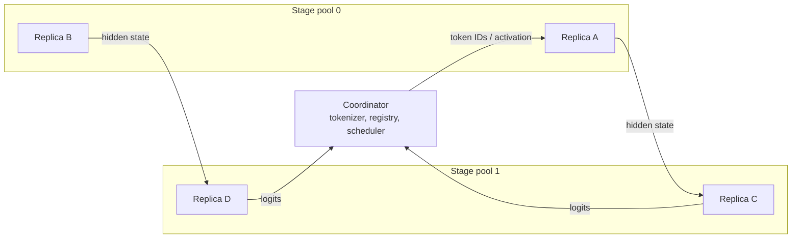
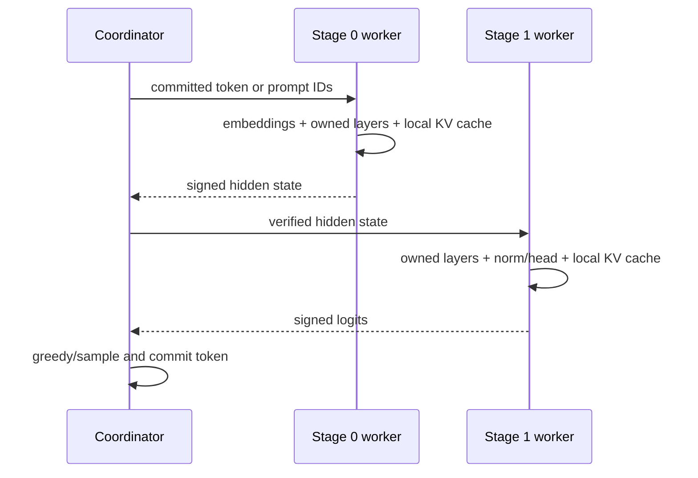
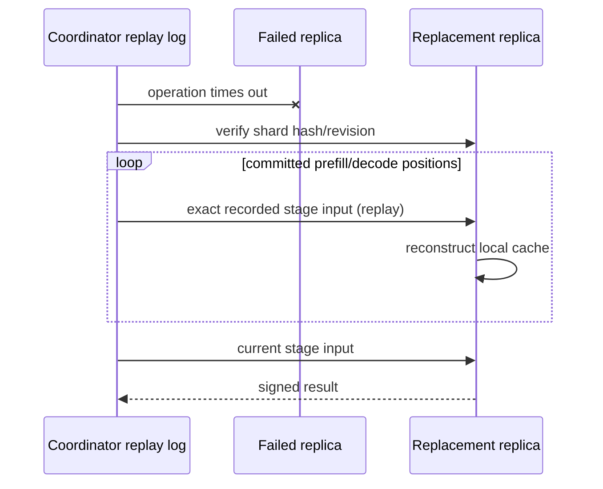

# Architecture

The initial design is centralised on purpose. Decentralised consensus and a DHT
would add failure modes before the scaling hypothesis has evidence.

## Coordinator

The coordinator owns model metadata, tokenizer state, worker registration,
placement, per-request routes, token commitment, audit decisions, and exact
stage-input replay logs. It does not instantiate a full model during a
distributed run. A full reference model is permitted only in the separate,
disclosed validation process.

Every scheduling decision retains candidates, rejection reasons, predicted
execution/queue/network components, reliability penalty, selection, actual
elapsed time, and prediction error. Static mode is the baseline. Fastest-route
mode minimises estimated completion time. Replicated placement balances stage
capacity and holds incomplete, non-beneficial replica rounds idle. Workload-tier
routing weights reliability/latency more strongly for interactive work.

## Workers and stage pools

A worker measures a registration profile, advertises an Ed25519 public key,
receives an explicit assignment, checks the stage hash and logical memory cap,
and constructs only that stage. Stage pools may contain replicas on different
hardware. A slow node never becomes a mandatory hop for an existing fast route.

The current transport is coordinator-relayed gRPC. The `ActivationTransport`
interface permits a future QUIC implementation without modifying worker
execution.

The OLMoE product slice uses a separate persistent stage-ring runtime. Its
coordinator sends prompt/token inputs to stage zero, while stage-boundary
activations travel directly between authenticated worker peers. Intermediate
activations do not pass through the coordinator in this product path. The
older experimental and dense-stage paths above remain documented separately.

## Model shards

The dense Qwen3 adapter reads `config.json` and safetensors indexes, maps every
source tensor to embeddings, one decoder layer, final normalisation, or output
head, and partitions contiguous layers. Tied tensors are duplicated only when
declared in `manifest.shared_tensors`. The generated union is compared with the
source state-dictionary key set. Each stage directory is SHA-256 hashed.

Workers expose a load proof containing logical bytes and source tensor names.
The coordinator may hold tokenizer and metadata, but not the full weights.

## Cache ownership and replay

Each cache is keyed by request, model revision, stage, cache generation, and
token position. Cancellation removes local state.

Replay avoids restarting a complete request when a compatible replica exists,
but can consume substantial coordinator storage, network bandwidth, and
additional compute. Periodic cache snapshots are a future extension behind the
same recovery boundary.

The product recovery mechanism is restart-and-replay, not transparent KV
migration. When a route fails, the coordinator stops accepting its output,
selects an exact eligible replacement, installs a higher signed route
generation, opens a fresh session, replays the prompt and every accepted token
through greedy decoding, and compares each replayed token with durable history.
Replay token events are suppressed. Generation resumes only after the entire
accepted prefix verifies; the first divergence fails the request without
emitting another client token.

## Integrity

Registrations, heartbeats, and result checksums are signed with Ed25519.
Selected operations may be duplicated across independent replicas. Exact
synthetic outputs use checksums; real outputs use configured tolerances.
Disagreements reduce reputation and can quarantine a worker. This is
probabilistic detection, not Byzantine fault tolerance or a proof of correct
neural computation.
