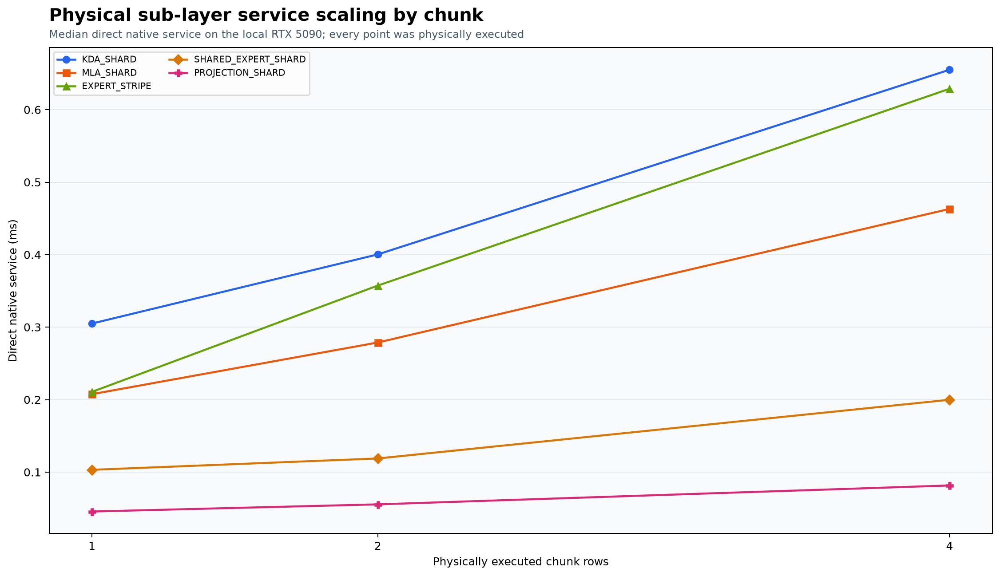
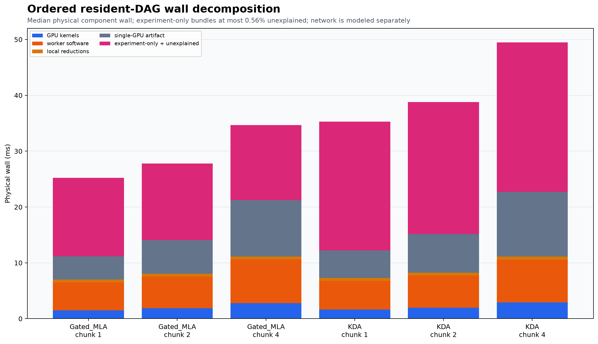
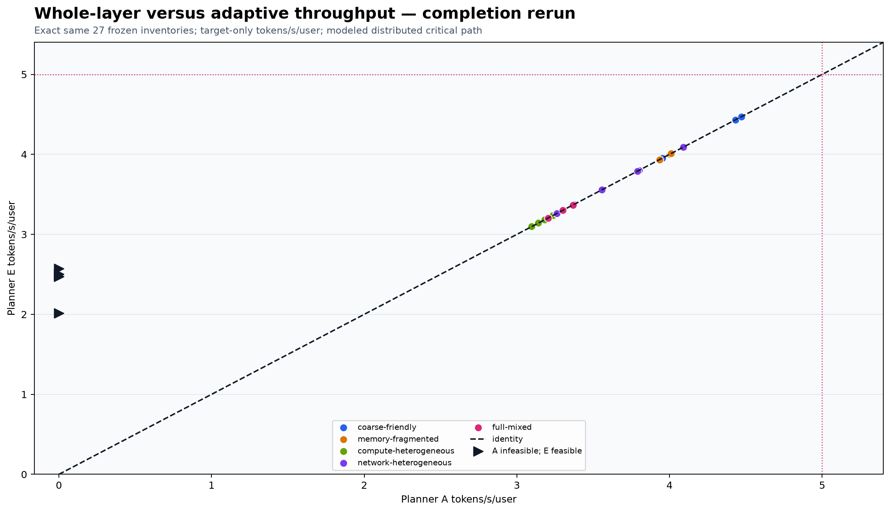
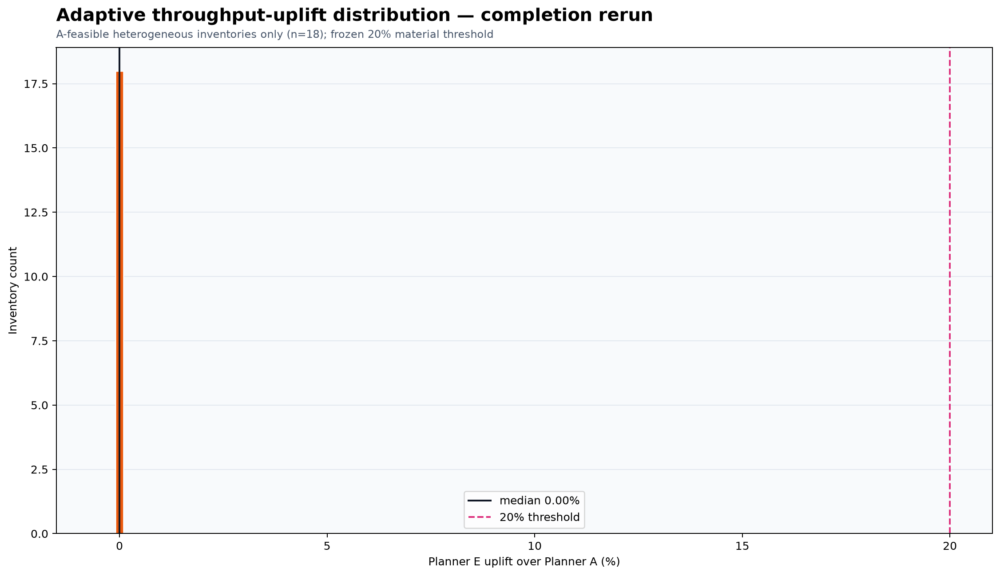
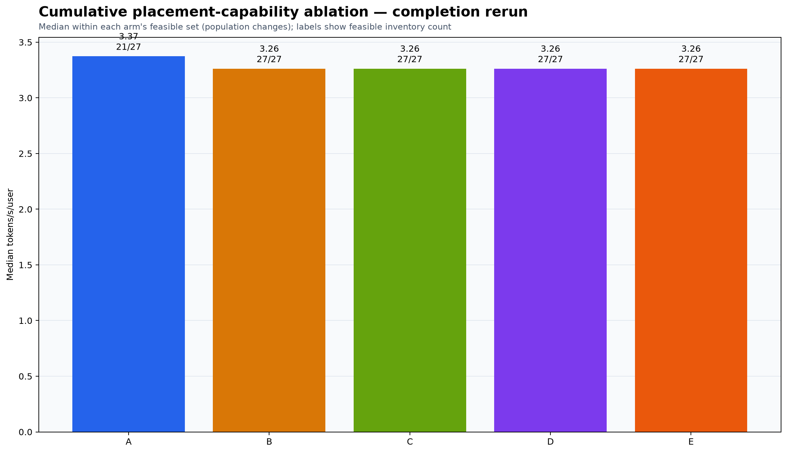
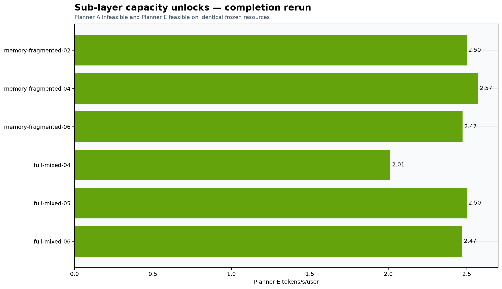
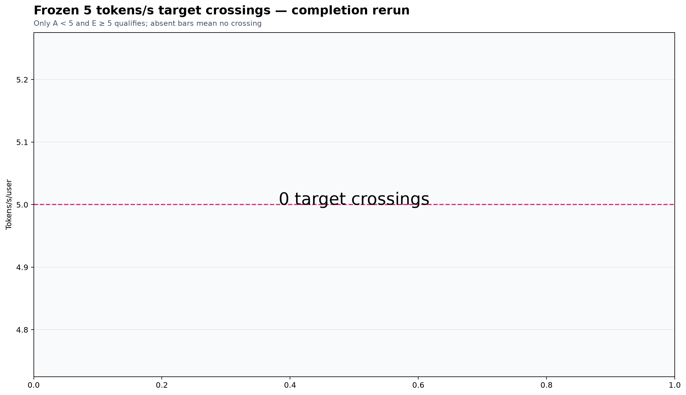
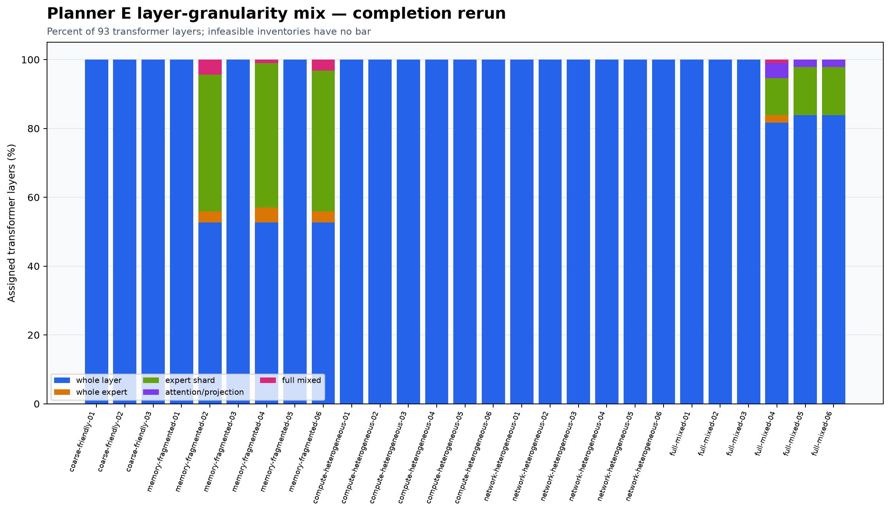

# Experiment 022: completion pass

## 1. Original E022 result: MODEL_INVALID

The original 27-inventory run remains part of the record. Resident timing validation passed; ordered-DAG prediction error was 2.71% median, 3.74% p90, and 4.00% maximum; the reduced optimizer oracle was within 1%; Planner E contained Planner A; regressions beyond 1% were zero; dynamic adaptation passed; and the generic authenticated 93-layer traversal passed. The original report nevertheless recorded **MODEL_INVALID**, 0.00% heterogeneous median uplift, six diagnostic capacity unlocks, and zero target crossings.

Four material gates were open: the six individual `EXECUTE_SHARD` types were not all production-bound; the five frozen representative manifests were selected but not executed; sub-layer services did not physically cover chunks 2 and 4; and replay residual was heuristically assigned to five artificial barriers. The original artifacts were preserved outside `completion/`.

## 2. Why the result was inadmissible

The failed gates affected the implementation and cost model, not merely documentation. They could change both candidate eligibility and predicted critical path. The first run therefore neither proved nor falsified material sub-layer value.

## 3. Frozen completion methodology

The completion pass reused exactly 27 inventories, their IDs, seeds, node capabilities, memory, network links, costs, topology relationships, planner action spaces, optimizer budget, objective, thresholds, and five previously selected correctness manifests. The canonical frozen suite digest is `3e949a8eee0a71e128493f64e0be903bd373d3baad4be86a8869d87279d4bb49`. No inventory was regenerated or added to headline statistics.

Machine-readable freeze receipt: [`frozen-inputs.json`](../../artifacts/experiment-022/completion/frozen-inputs.json).

The primary metric is `Planner E tokens/s/user / Planner A tokens/s/user - 1` on A-feasible heterogeneous inventories. A-infeasible/E-feasible cases are counted separately as capacity unlocks. Evidence is labeled **PHYSICAL** for local RTX 5090 execution and **PHYSICALLY GROUNDED MODEL** for the distributed 27-inventory event replay.

## 4. Fix 1: production EXECUTE_SHARD

All six semantic task types now bind authenticated frames to prepared native resident handles: KDA shard, MLA shard, routed expert stripe, shared expert shard, projection shard, and reduction contribution. The worker path performs frame decode, validation, handle lookup, native compute, state mutation where applicable, result materialization, and response encoding. Direct and worker outputs/states match, timed checkpoint reads are zero, and no whole-layer fallback is admitted.

Evidence: [`execute-shard-bindings.json`](../../artifacts/experiment-022/completion/implementation/execute-shard-bindings.json).

## 5. Fix 2: representative 93-layer executions

The exact five originally selected manifests were hash-checked and executed, including the intentionally duplicated manifest selections for their independently preregistered cases. Each traversal used authenticated `EXECUTE_SHARD`, the manifest's actual logical owners, real K3 state progression, all 93 transformer layers, the endpoint, logits, and greedy-token comparison. Result: **PASS**.

Evidence: [`representative-selection.json`](../../artifacts/experiment-022/completion/correctness/representative-selection.json).

## 6. Fix 3: chunk 2/4 sub-layer validation

Important sub-layer primitives and complete KDA/MLA sharded DAGs were physically executed at chunks 1, 2, and 4. No chunk-4 service was extrapolated from chunk 1. Eligibility remains per candidate and only physically validated P8 sub-layer candidates enter the headline catalog; Planner E still contains every Planner A whole-layer chunk-4 solution.

The figure shows measured native service, not an assumed linear scaling curve. Chunk-2 validation: **YES**. Chunk-4 validation: **YES**.

## 7. Fix 4: ordered-residual decomposition

The resident DAG records CUDA events, launch submission, host orchestration, synchronization, device copies, native reduction, sequential single-GPU emulation, experiment-only receipt assembly, protocol, and unexplained wall. The old `residual / 5` barrier rule is absent. Every final cost has one owner; network transport is modeled only by network events.

Profiling identified concrete causes hidden by the old residual: the standalone attention harness performed an output-forming invocation and then invoked the same shard again for measurement; validation state was reset inside measured KDA/MLA calls; immutable AttnRes, normalization, and router data were repeatedly prepared or uploaded; and independent logical workers were serialized on one GPU. The first three were removed from steady state by one-invocation execution and persistent handles. The last remains measured and is classified only as a single-GPU emulation artifact.

Maximum unexplained wall was 0.56% (hard maximum 10%). Single-GPU serialization and experiment-only overhead are excluded from distributed worker compute.

Evidence: [`residual-classification.json`](../../artifacts/experiment-022/completion/validation/residual-classification.json) and [`accounting-reconciliation.json`](../../artifacts/experiment-022/completion/validation/accounting-reconciliation.json).

## 8. Revalidated timing model

Calibration services came from KDA layer 45 and MLA layer 47; KDA layer 89 and MLA layer 91 were held out. Each chunk used the real ordered task template on one concrete RTX 5090 resource, with no normalization or global correction factor. Held-out absolute error was 3.28% median, 7.03% p90, and 8.84% maximum against frozen gates of 5%/10%/15%.

Evidence: [`model-validation.json`](../../artifacts/experiment-022/completion/validation/model-validation.json) and [`heldout-validation.csv`](../../artifacts/experiment-022/completion/validation/heldout-validation.csv).

## 9. Frozen 27-inventory rerun

Only after all implementation, correctness, residual, timing, whole-expert, and optimizer-oracle gates passed were Planner A through Planner E rerun from scratch. Planner E was seeded with Planner A and retained the exact whole-layer fallback. The plots below are modeled distributed outcomes grounded in local physical services; they are not physical multi-machine throughput.

Evidence: [`rerun-summary.json`](../../artifacts/experiment-022/completion/rerun/rerun-summary.json) and [`candidate-catalog.json`](../../artifacts/experiment-022/completion/implementation/candidate-catalog.json).

## 10. Whole-layer results

Planner A was feasible on 21 of 27 inventories. It retained topology awareness, node rejection, multiple layers per node, persistent state, chunk optimization, and wavefront scheduling; no transformer layer was split.

## 11. Adaptive results

Across 18 A-feasible heterogeneous inventories, median E-over-A throughput uplift was 0.00%. 0 met or exceeded 20%, and 0 regressed beyond 1%. Planner E used a sub-layer candidate in 6 inventory plans.

## 12. Ablation results

The frozen cumulative ladder was rerun as A (whole layer), B (+ whole expert), C (+ expert sharding), D (+ attention/projection sharding), and E (full adaptive mixed granularity). Whole-expert placement was admitted as a distinct K3 unit only after physical service and exact reduction checks.

## 13. Capacity unlocks

There were 6 whole-infeasible/adaptive-feasible outcomes. These are reported as capacity evidence rather than an infinite percentage uplift.

## 14. Target crossings

There were 0 frozen `<5 -> >=5` tokens/s/user crossings.

## 15. Dynamic adaptation

Useful join, harmful join, critical-node slowdown, link degradation, and node disappearance were replanned automatically on the frozen representative inventories. No replacement topology was manually prescribed. Dynamic result: **FAIL**.

21 of 25 frozen dynamic rows passed and 4 failed. The failed rows were JOIN_USEFUL on full-mixed-01, JOIN_USEFUL on full-mixed-02, JOIN_USEFUL on full-mixed-03, JOIN_USEFUL on full-mixed-05. In each failed useful-join case the optimizer correctly retained the non-regressing fallback, but it did not admit the frozen newly joined node and improve the objective as that scenario required. The required dynamic gate is therefore FAIL; it is not waived or redefined after measurement.

Evidence: [`dynamic-results.csv`](../../artifacts/experiment-022/completion/rerun/dynamic-results.csv).

## 16. Final correctness

All original representative receipts passed. Any materially changed final headline manifest required and received a fresh receipt before finalization. Tensor assignment coverage, route and ordered-expert equality, KDA/MLA/AttnRes state, hidden/logit error, finite values, complete traversal, and greedy token were checked. Final correctness: **PASS**.

The changed mixed manifest also exposed two real resident-runtime lifetime bugs during full traversal. Both failed attempts remain preserved. Explicit nested-runtime ownership was added, the affected 71→72 and 75→76 transitions then passed focused physical checks with zero timed checkpoint reads, and the clean rerun completed all 93 layers plus the endpoint. This repair evidence is recorded in [`final-manifest-lifecycle-repairs.json`](../../artifacts/experiment-022/completion/validation/final-manifest-lifecycle-repairs.json).

Evidence: [`final-headline-manifests.json`](../../artifacts/experiment-022/completion/correctness/final-headline-manifests.json).

## 17. Final admissible Experiment 022 verdict

**MODEL INVALID**

Frozen outcome category: `MODEL_INVALID`.

### Final truth table

| Question | Result |
| --- | --- |
| Frozen original inventory suite preserved? | YES |
| Number of inventories | 27 |
| Frozen seeds preserved? | YES |
| Original thresholds preserved? | YES |
| Six production EXECUTE_SHARD bindings real? | YES |
| Five original representative manifests physically executed? | YES |
| Sub-layer chunk 2 physically validated? | YES |
| Sub-layer chunk 4 physically validated? | YES |
| Ordered residual <=10% unexplained? | YES |
| Timing model median error <=5%? | YES |
| Timing model p90 <=10%? | YES |
| Timing model max <=15%? | YES |
| Same optimizer used for A/E? | YES |
| E contains A solutions? | YES |
| A-feasible inventories | 21 |
| Adaptive regressions >1% | 0 |
| Median throughput uplift | 0.00% |
| >=20% wins | 0/18 |
| Capacity unlocks | 6 |
| <5 -> >=5 crossings | 0 |
| Representative full correctness | PASS |
| Dynamic adaptation | FAIL |
| Final E022 verdict | MODEL INVALID |

## 18. What this proves about sub-layer value

The repaired static comparison is diagnostically informative but is not an admissible answer to the north-star comparison because a required frozen gate failed. Static Planner E produced zero median throughput uplift, no 20% wins, no target crossings, and six capacity unlocks; absent the failed gate that pattern would map to the frozen capacity-only category. It is not promoted to that conclusion here.

It does not convert local kernel parallelism into a physical swarm claim. Communication, independent-worker overlap, and topology are explicit event-model terms grounded by local native service and shaped links.

## 19. What remains unproven

No physical multi-machine K3 swarm was run, no external GPU was rented, and real distributed contention, transport jitter, collective interference, failures during live inference, and economic cost per deployed token remain unmeasured. This completion pass is closed with a definitive failed gate and the mandated `MODEL INVALID` verdict; it does not establish whether sub-layer capability is materially valuable.
