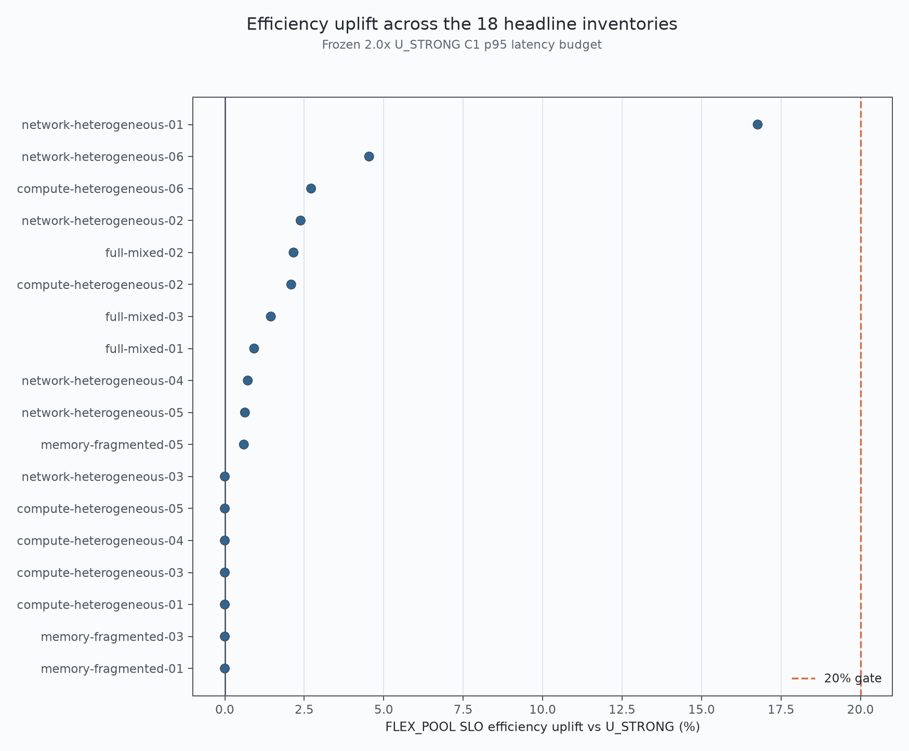
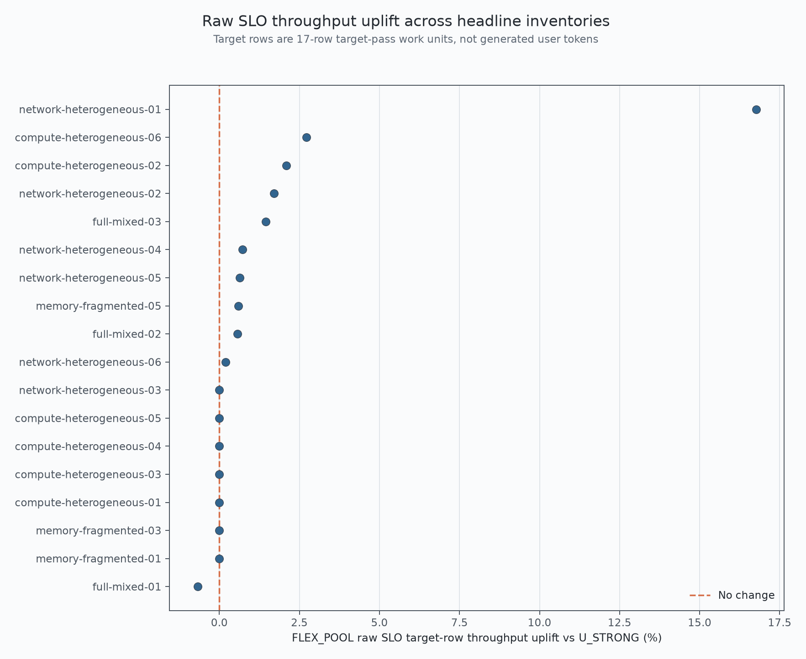
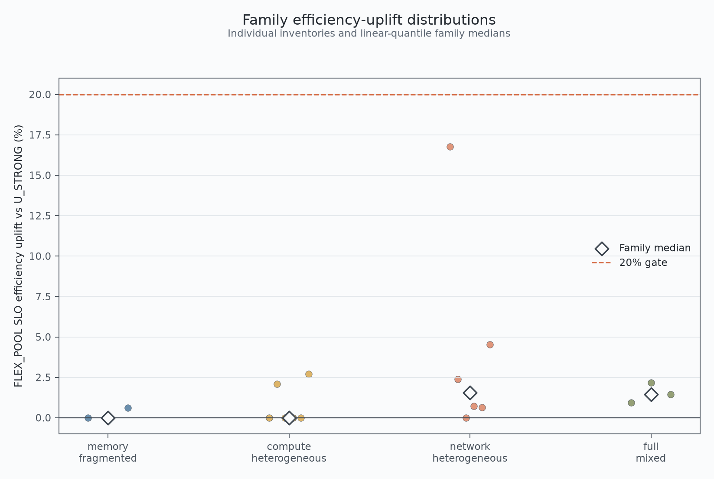
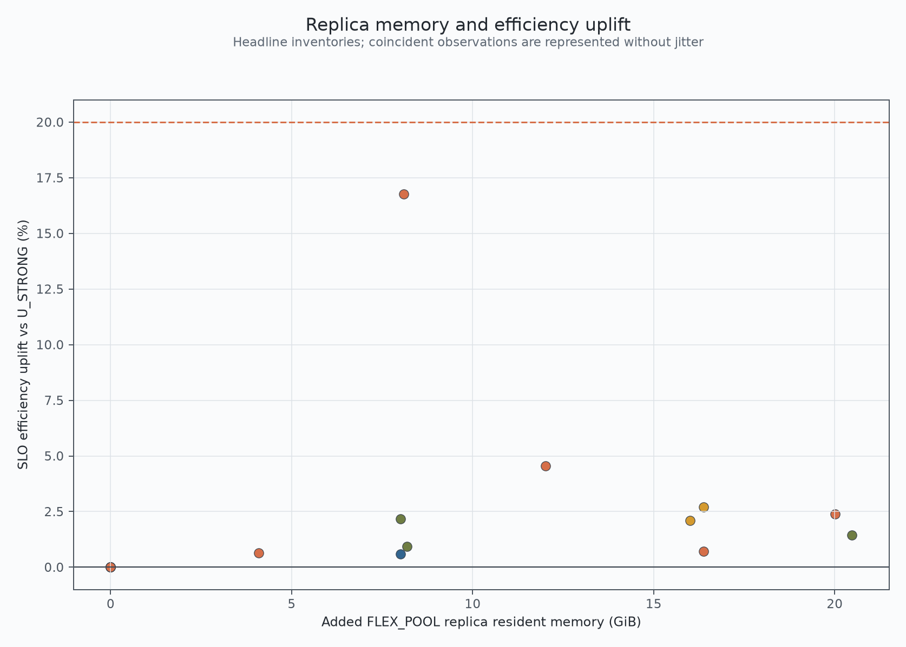
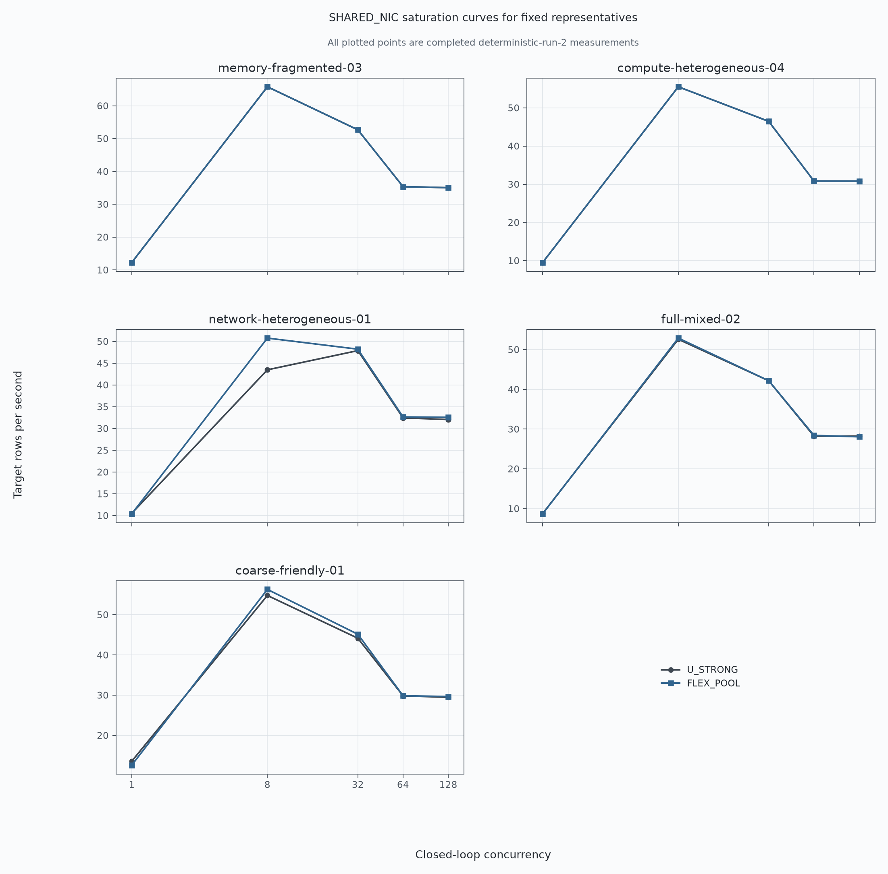
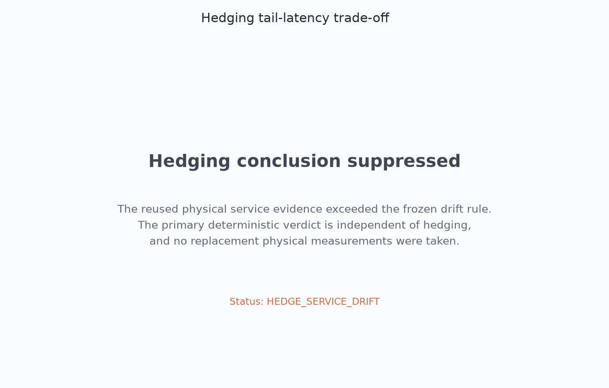

# Experiment 023: Exact Sparse Expert Optionality

## Final Verdict

**NO_WEDGE**

Mandatory validity failures: None. The repaired evidence path passed every mandatory validity gate.

The original `deterministic-run-1` verdict remains permanently **MODEL_INVALID**. The category above is the result of the repaired authoritative `deterministic-run-2`, validated against independently planned `deterministic-run-3`.

## Executive Summary

Across the 18 frozen headline inventories, median FLEX_POOL efficiency uplift was +0.68%, mean uplift was +1.94%, p90 was +3.26%, and the maximum was +16.76%. 0 of 18 reached the frozen 20% threshold. Median raw SLO throughput uplift was +0.38%.

All three negative controls passed. FLEX_POOL passed its mandatory 27/27 superset audit, and U_STRONG matched run 1 in 27/27 inventories.

## Why the First Attempt Was Invalid

`deterministic-run-1` optimized C32 throughput (or C32 throughput per abstract cost) but was judged by a five-point hard-SLO selector. `coarse-friendly-03` exposed that mismatch when a locally attractive plan narrowly crossed the C8 latency boundary and fell to C1. FLEX_POOL also failed to retain its legal FLEX_FREE subset because completion-only primary and alternate pruning removed lower-cost candidates. Those defects made run 1 non-promotable; its files and verdict were not rewritten.

## Repair Protocol

The preregistered repair is recorded in `artifacts/experiment-023/repair/repair-protocol.json`. Action acceptance now uses the single canonical full-ladder SLO scorer. C32 remains only a heuristic. FLEX_POOL searches POOL-U and POOL-FREE branches and selects from U_STRONG, FLEX_FREE, POOL-U, and POOL-FREE. The repaired code was frozen after the three-control pilot and before headline execution.

## Frozen Scientific Contract

The original question, hypothesis, seed, 27 inventories, 18 headline cases, three controls, six capacity cases, P8 degree, maximum six actions, 2.0x latency multiplier, +0.5% action gain, 1% throughput guard, 20% wedge threshold, routing policy, and SHARED_NIC model were unchanged. The frozen constants canonical SHA-256 is `0b5e502e22bb0fca8cbb0dc0d8d0f80b3abd3610c34f2634e399900fc9c45f4b`.

## Physical Replica Validation

The unchanged physical prerequisite passed 12/12 cases with maximum A/B relative L2 0, maximum memory estimation error 3.809%, and 2400 service samples. This is local RTX 5090 primitive evidence, not physical multi-machine throughput.

## U_STRONG Baseline Integrity

Repaired U_STRONG canonical plan hashes matched `deterministic-run-1` exactly in 27/27 inventories. Baseline construction was not changed by this repair.

## Repaired FLEX Planner

Every structurally feasible action reaching selection was evaluated at concurrency 1, 8, 32, 64, and 128. FLEX_FREE maximized SLO-selected raw throughput without new nodes. FLEX_POOL maximized SLO-selected throughput per abstract cost. Both applied the exact +0.5% objective gate, local 1% throughput guard, and cumulative 1% guard against U_STRONG.

## FLEX_POOL Superset Audit

The audit passed 27/27. Every final envelope explicitly contained the current FLEX_FREE plan, and harmful optionality could be declined.

## Negative Controls

All controls passed both -5% efficiency and raw-throughput limits for FLEX_FREE and FLEX_POOL. The detailed rows are in `analysis/uplift.csv` and `validation/flex-pool-superset.csv`.

## Primary 18-Inventory Results

Median efficiency uplift: +0.678%. Mean: +1.943%. P90: +3.262%. Maximum: +16.764%. Wins at or above 20%: 0/18. Median raw throughput uplift: +0.378%. Worst efficiency: +0.000%. Worst raw throughput: -0.682%. Actual alternate users: 11/18.

## Family Results

Qualifying preregistered families: **none**.

| Family | n | Median efficiency | >=20% | Median raw throughput | Replicas used | Gate |
|---|---:|---:|---:|---:|---:|---|
| memory-fragmented | 3 | +0.00% | 0 | +0.00% | 1 | FAIL |
| compute-heterogeneous | 6 | +0.00% | 0 | +0.00% | 2 | FAIL |
| network-heterogeneous | 6 | +1.55% | 0 | +0.68% | 5 | FAIL |
| full-mixed | 3 | +1.45% | 0 | +0.57% | 3 | FAIL |

## Optionality-Only Ablation

FLEX_POOL optionality-only median was +0.296% and maximum was +14.249%. NO_ALT arms were derived by removing only alternate residency; they were not independently optimized.

## FLEX_FREE Zero-New-Node Result

FLEX_FREE median efficiency uplift was +0.616% and maximum was +16.764%. `ZERO_NEW_NODE_WEDGE` is **FALSE**; its frozen diagnostic gate is `{'zero_new_node_wedge': False, 'general_gate': False, 'family_gates': {'memory-fragmented': False, 'compute-heterogeneous': False, 'network-heterogeneous': False, 'full-mixed': False}, 'median_efficiency_uplift_percent': 0.6164900801092554, 'cases_ge_20_percent': 0, 'median_raw_throughput_uplift_percent': 0.5836386705862173}`.

## Network-Heterogeneous Results

For `network-heterogeneous-01`, repaired FLEX_POOL efficiency uplift was +16.764%, raw SLO throughput uplift was +16.764%, optionality-only uplift was +14.249%, selected SLO concurrency was 8, and actual alternate use was True.

## Capacity-Exploratory Results

The six frozen exploratory cases had median efficiency uplift +2.302% and median raw throughput uplift +1.453%. They cannot promote the primary verdict.

## Legacy Network Robustness

Median legacy efficiency uplift was +0.000%, with 11/18 non-negative cases.

## Full Correctness

The five production-native authenticated 93-layer receipts have aggregate status **PASS**.

- `memory-fragmented-03`: **PASS**; replicas 0, forced alternates 0.
- `compute-heterogeneous-04`: **PASS**; replicas 0, forced alternates 0.
- `network-heterogeneous-01`: **PASS**; replicas 4, forced alternates 1.
- `full-mixed-02`: **PASS**; replicas 4, forced alternates 2.
- `coarse-friendly-01`: **PASS**; replicas 12, forced alternates 6.

The replica-aware override changed only physical worker destination. Logical group, tensor ownership, expert range, routes, weights, reduction slot, and canonical group reduction order remained unchanged.

## Reproducibility

Deterministic reproducibility status: **PASS**. Canonical plan hash matches: 135/135; U_STRONG: 27/27; maximum deterministic float relative difference: 0.0.

## Hedging Diagnostic

Hedging is **SUPPRESSED** under the unchanged `HEDGE_SERVICE_DRIFT` rule. Maximum physical service drift was 71.931%. No new physical samples were taken, and hedging does not affect the primary E023 verdict.

## Limitations

Fleet serving results remain a physically grounded model with shaped network semantics, not a physical multi-machine deployment. Correctness multiplexes logical manifest workers on one RTX 5090. Abstract node cost is not a dollar price. The hard SLO remains discontinuous; `analysis/slo-boundary-analysis.csv` exposes those cliffs without changing them.

## What E023 Proves

E023 establishes exactly the result represented by **NO_WEDGE** under the frozen modeled inventory and validity contract. It also establishes physical duplicate-group substitutability within the fixed numerical gate and verifies whether the repaired planner can safely retain U_STRONG and FLEX_FREE.

## What E023 Does Not Prove

E023 does not prove real multi-machine transport, contention, straggler behavior, dollar economics, or production user-token throughput. It does not justify a subgroup outside the four preregistered families, a threshold change, a routing redesign, or a new inference technique.

## Decision for E024

**Stop pursuing exact replica optionality as the primary wedge. E024 moves to communication-avoiding block composition and materialization-boundary retiming.**

## Reproduction

Run the compatibility gate, three-control pilot, code-freeze check, `deterministic-run-2`, five full correctness representatives, independently planned `deterministic-run-3`, reproducibility comparison, and finalizer with `PYTHONPATH=src`. Exact commands are in `artifacts/experiment-023/commands.txt`. Run-2 wall time was 71169.575 seconds; run-3 wall time was 72296.32063699997 seconds.
